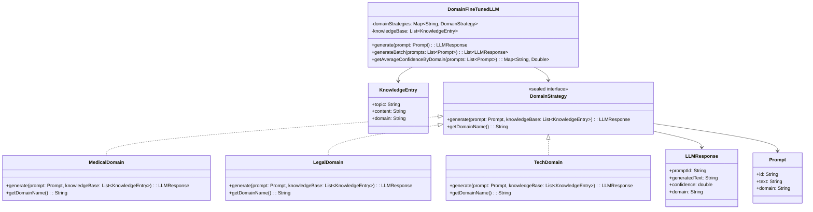

# **Domain Fine-Tuned LLM**

## Overview

Simulated domain-specific language model demonstrating the **Strategy Pattern** with specialized knowledge bases for medical, legal, and technical domains using template-based generation without actual LLM integration.

---

## Tech Stack

- **Java 25** → Latest JDK with modern language features including records and sealed interfaces.
- **Gradle** → Build automation and dependency management.
- **JUnit 5** → Testing framework for unit tests.

---

## Architecture Diagram



---

## Setup Instructions

### 1 - Clone the Repository
```bash
git clone https://github.com/rbleggi/tech-pocs.git
cd java/domain-fine-tuned-llm
```

### 2 - Compile & Run the Application
```bash
./gradlew run
```

### 3 - Run Tests
```bash
./gradlew test
```
