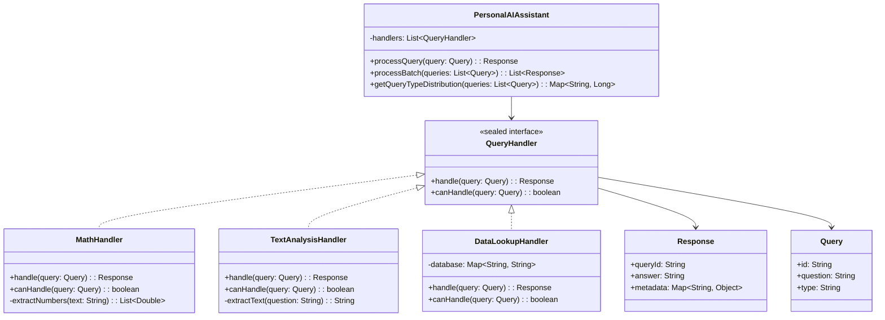

# **Personal AI Assistant**

## Overview

Personal AI assistant system demonstrating the **Strategy Pattern** with query handlers for mathematical operations, text analysis, and data lookup using rule-based processing without actual AI/ML integration.

---

## Tech Stack

- **Java 25** → Latest JDK with modern language features including records and sealed interfaces.
- **Gradle** → Build automation and dependency management.
- **JUnit 5** → Testing framework for unit tests.

---

## Architecture Diagram



---

## Setup Instructions

### 1 - Clone the Repository
```bash
git clone https://github.com/rbleggi/tech-pocs.git
cd java/personal-ai-assistant
```

### 2 - Compile & Run the Application
```bash
./gradlew run
```

### 3 - Run Tests
```bash
./gradlew test
```
