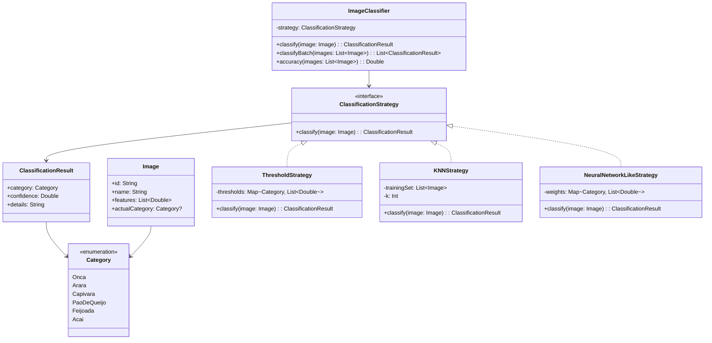

# **Image Classification**

## Overview

Image classification system demonstrating the **Strategy Pattern** with three different classification algorithms: threshold-based, K-Nearest Neighbors (KNN), and neural network-like classification using Brazilian fauna and food categories.

---

## Tech Stack

- **Kotlin 2.2.20** → Modern JVM language with concise syntax and null safety.
- **Gradle** → Build automation tool with Kotlin DSL support.
- **JDK 25** → Required to run the application.
- **kotlin.test** → Testing framework.

---

## Architecture Diagram



---

## Setup Instructions

### 1 - Clone the Repository
```bash
git clone https://github.com/rbleggi/tech-pocs.git
cd ai/kotlin/image-classification
```

### 2 - Build the Project
```bash
./gradlew build
```

### 3 - Run Tests
```bash
./gradlew test
```
