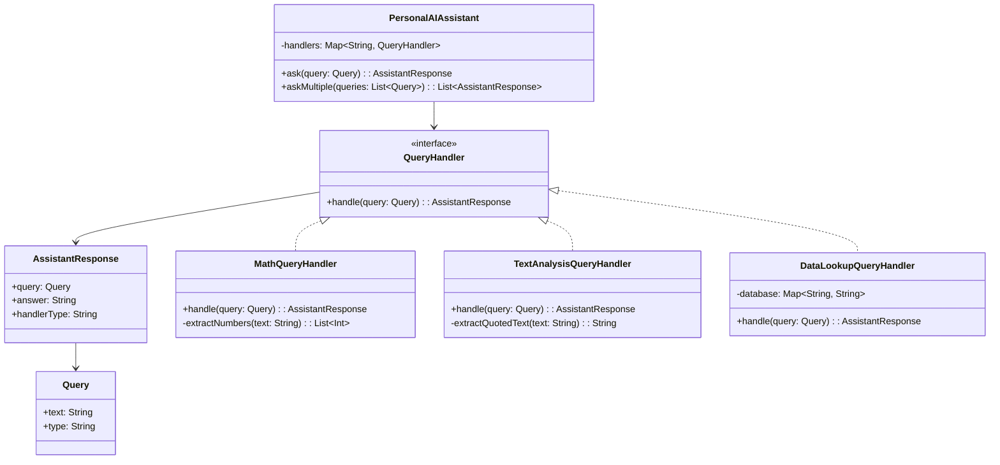

# **Personal AI Assistant**

## Overview

Personal AI assistant demonstrating the **Strategy Pattern** with specialized query handlers: mathematical operations, text analysis, and data lookup. Routes queries to appropriate handlers without actual AI integration.

---

## Tech Stack

- **Kotlin 2.1.10** → Modern JVM language with concise syntax and null safety
- **Gradle 9.3.0** → Build automation tool
- **JDK 25** → Required to run the application
- **kotlin.test** → Testing framework

---

## Architecture Diagram



---

## Setup Instructions

### 1 - Clone the Repository
```bash
git clone https://github.com/rbleggi/tech-pocs.git
cd kotlin/personal-ai-assistant
```

### 2 - Build the Project
```bash
./gradlew build
```

### 3 - Run the Application
```bash
./gradlew run
```

### 4 - Run Tests
```bash
./gradlew test
```
