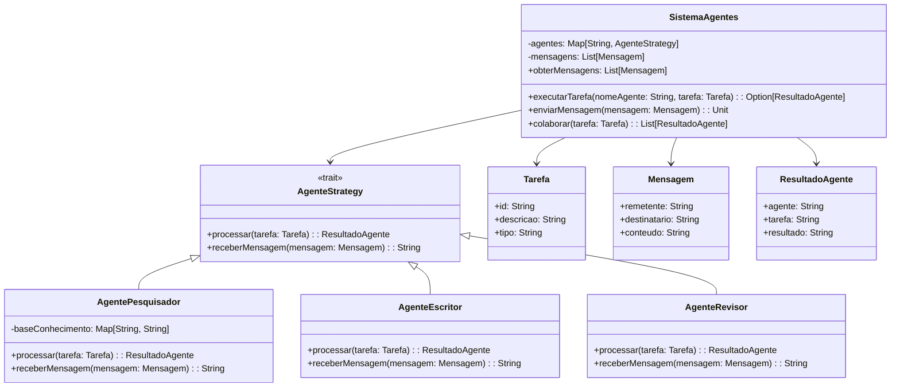

# **AI Agent System**

## Overview

This project implements a multi-agent AI system using the Strategy Pattern in Scala 3. It supports different agent types (Researcher, Writer, Reviewer) that collaborate on tasks, exchanging messages and results to complete complex workflows.

---

## Tech Stack

- **Language** → Scala 3.6.3
- **Build Tool** → sbt 1.10.11
- **Runtime** → JDK 25
- **Testing** → ScalaTest 3.2.16

---

## Architecture Diagram



---

## Setup Instructions

### 1 - Clone

```bash
git clone https://github.com/rbleggi/tech-pocs.git
cd scala-3/ai-agent-system
```

### 2 - Build

```bash
sbt compile
```

### 3 - Test

```bash
sbt test
```
