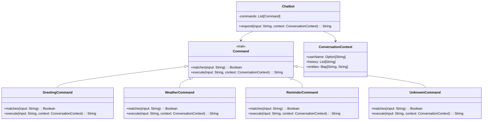

# **AI Chatbot**

## Overview

Chatbot using traditional NLP techniques (intent recognition, entity extraction) with conversation management and context tracking.

---

## Tech Stack

- **Language** -> Scala 3.6.3
- **Build Tool** -> sbt 1.10.11
- **Runtime** -> JDK 25
- **Testing** -> ScalaTest 3.2.16

---

## Architecture Diagram



---

## Setup Instructions

### 1 - Clone

```bash
git clone https://github.com/rbleggi/tech-pocs.git
cd scala-3/chatbot
```

### 2 - Build

```bash
sbt compile
```

### 3 - Test

```bash
sbt test
```
