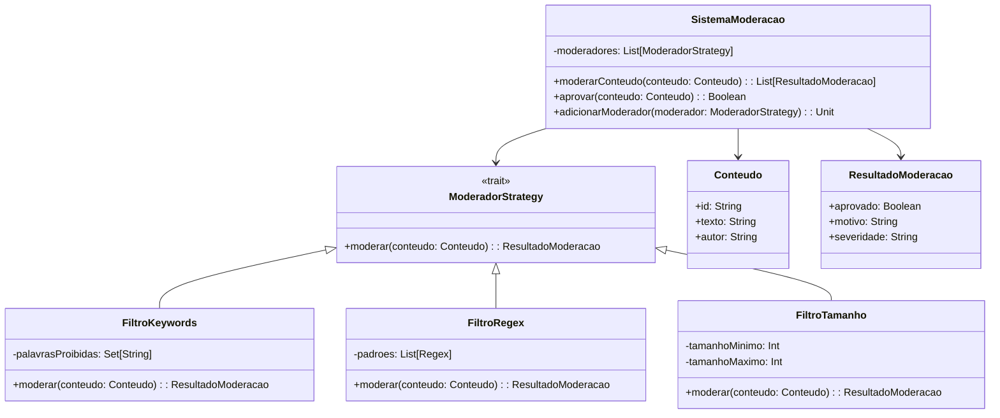

# **Content Moderation System**

## Overview

This project implements a content moderation system using the Strategy Pattern in Scala 3. It supports multiple moderation strategies (Keyword Filter, Regex Filter, Length Filter) to detect prohibited content, sensitive data, and enforce content policies.

---

## Tech Stack

- **Language** → Scala 3.6.3
- **Build Tool** → sbt 1.10.11
- **Runtime** → JDK 25
- **Testing** → ScalaTest 3.2.16

---

## Architecture Diagram



---

## Setup Instructions

### 1 - Clone

```bash
git clone https://github.com/rbleggi/tech-pocs.git
cd scala-3/content-moderation-system
```

### 2 - Build

```bash
sbt compile
```

### 3 - Test

```bash
sbt test
```
