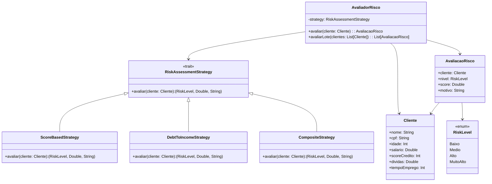

# **Credit Risk Assessment**

## Overview

This project implements a credit risk assessment system for Brazilian clients using the Strategy Pattern. It includes three evaluation strategies: Score-Based, Debt-to-Income Ratio, and Composite, enabling flexible risk classification based on financial profiles including CPF, salary, credit score, and debt levels.

---

## Tech Stack

- **Language** → Scala 3.6.3
- **Build Tool** → sbt 1.10.11
- **Runtime** → JDK 25
- **Testing** → ScalaTest 3.2.16

---

## Architecture Diagram



---

## Setup Instructions

### 1 - Clone

```bash
git clone https://github.com/rbleggi/tech-pocs.git
cd scala-3/credit-risk-assessment
```

### 2 - Build

```bash
sbt compile
```

### 3 - Test

```bash
sbt test
```
