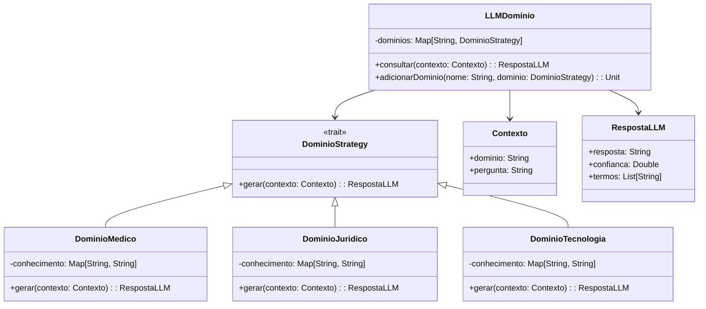

# **Domain Fine-Tuned LLM**

## Overview

This project implements a domain-specific language model using the Strategy Pattern in Scala 3. It supports multiple specialized domains (Medical, Legal, Technology) with knowledge bases, providing contextually accurate responses based on domain expertise.

---

## Tech Stack

- **Language** → Scala 3.6.3
- **Build Tool** → sbt 1.10.11
- **Runtime** → JDK 25
- **Testing** → ScalaTest 3.2.16

---

## Architecture Diagram



---

## Setup Instructions

### 1 - Clone

```bash
git clone https://github.com/rbleggi/tech-pocs.git
cd scala-3/domain-fine-tuned-llm
```

### 2 - Build

```bash
sbt compile
```

### 3 - Test

```bash
sbt test
```
