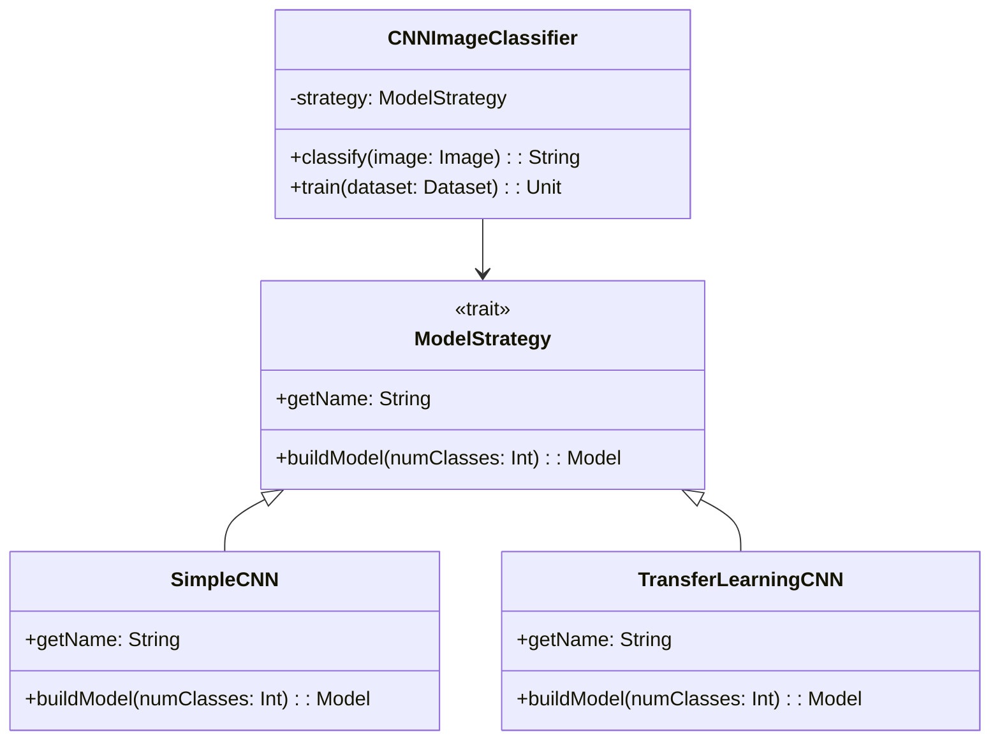

# **Image Classification**

## Overview

Image classification system using CNNs to classify different categories of images with data augmentation and transfer learning. Demonstrates convolutional neural networks for spatial feature extraction and transfer learning with pre-trained models for faster training.

---

## Tech Stack

- **Language** -> Scala 3.6.3
- **Build Tool** -> sbt 1.10.11
- **Runtime** -> JDK 25
- **Testing** -> ScalaTest 3.2.16
- **DJL** -> 0.30.0 (Deep Java Library)
- **PyTorch Engine** -> 0.30.0

---

## Architecture Diagram



---

## Setup Instructions

### 1 - Clone

```bash
git clone https://github.com/rbleggi/tech-pocs.git
cd scala-3/image-classification
```

### 2 - Build

```bash
sbt compile
```

### 3 - Test

```bash
sbt test
```
