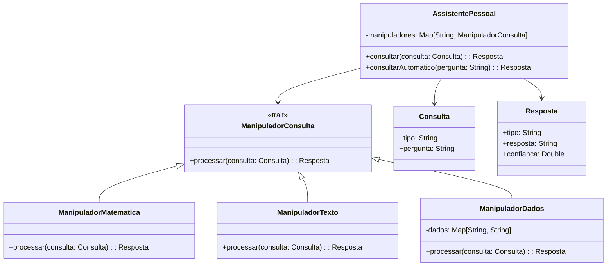

# **Personal AI Assistant**

## Overview

This project implements a personal AI assistant using the Strategy Pattern in Scala 3. It handles different types of queries (math, text analysis, data lookup) with specialized handlers, providing intelligent responses for various question types.

---

## Tech Stack

- **Language** -> Scala 3
- **Build Tool** -> sbt
- **Testing** -> ScalaTest 3.2.16
- **JDK** -> 25

---

## Architecture Diagram



---

## Setup Instructions

### 1 - Clone

```bash
git clone https://github.com/rbleggi/tech-pocs.git
cd scala-3/personal-ai-assistant
```

### 2 - Build

```bash
sbt compile
```

### 3 - Test

```bash
sbt test
```
