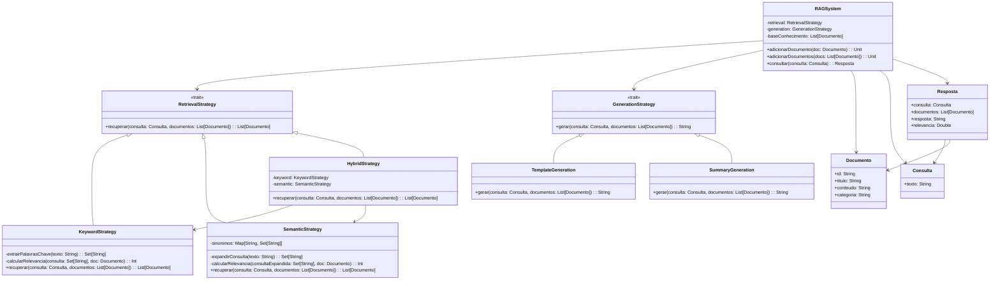

# **RAG System (Retrieval-Augmented Generation)**

## Overview

This project implements a Retrieval-Augmented Generation (RAG) system using the Strategy Pattern in Scala 3. It supports Portuguese document retrieval with multiple strategies (Keyword, Semantic, Hybrid) and response generation approaches (Template, Summary), enabling flexible question-answering over knowledge bases.

---

## Tech Stack

- **Language** -> Scala 3
- **Build Tool** -> sbt
- **Testing** -> ScalaTest 3.2.16
- **JDK** -> 25

---

## Architecture Diagram



---

## Setup Instructions

### 1 - Clone

```bash
git clone https://github.com/rbleggi/tech-pocs.git
cd scala-3/rag-system
```

### 2 - Build

```bash
sbt compile
```

### 3 - Test

```bash
sbt test
```
