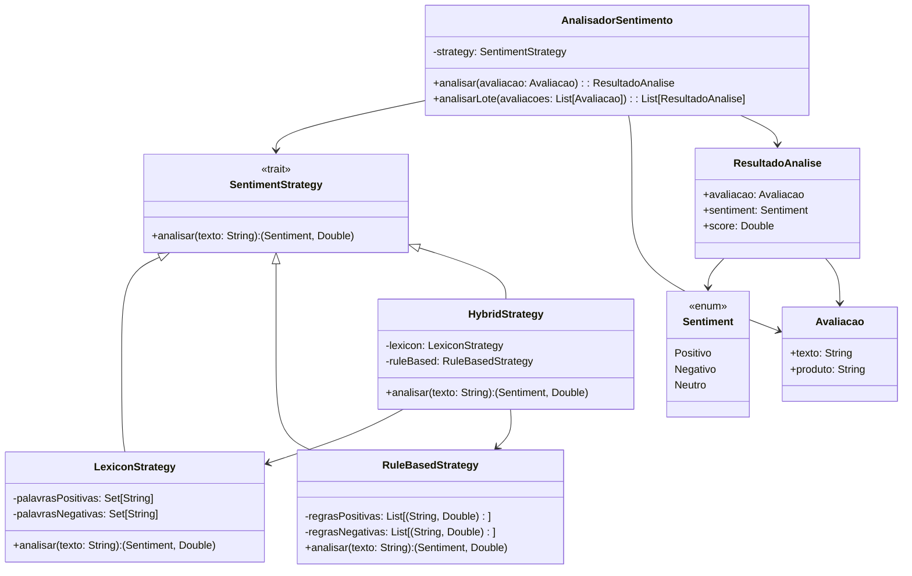

# **Sentiment Analysis**

## Overview

This project implements a sentiment analysis system for Brazilian Portuguese product reviews using the Strategy Pattern. It includes three analysis strategies: Lexicon-based, Rule-based, and Hybrid, enabling flexible classification of text as positive, negative, or neutral sentiment.

---

## Tech Stack

- **Language** -> Scala 3
- **Build Tool** -> sbt
- **Testing** -> ScalaTest 3.2.16
- **JDK** -> 25

---

## Architecture Diagram



---

## Setup Instructions

### 1 - Clone

```bash
git clone https://github.com/rbleggi/tech-pocs.git
cd scala-3/sentiment-analysis
```

### 2 - Build

```bash
sbt compile
```

### 3 - Test

```bash
sbt test
```
