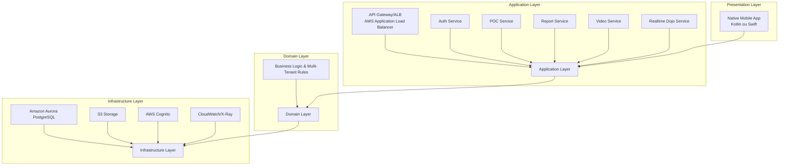
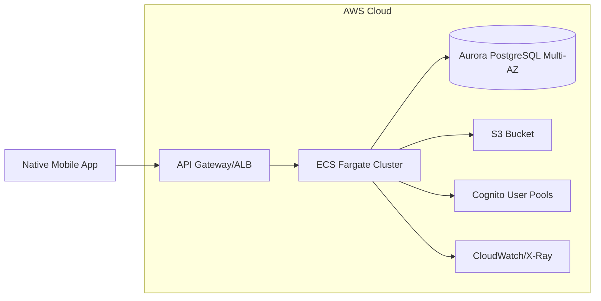
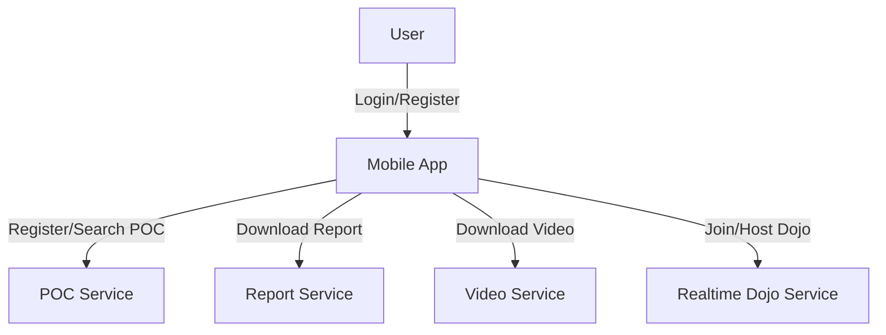
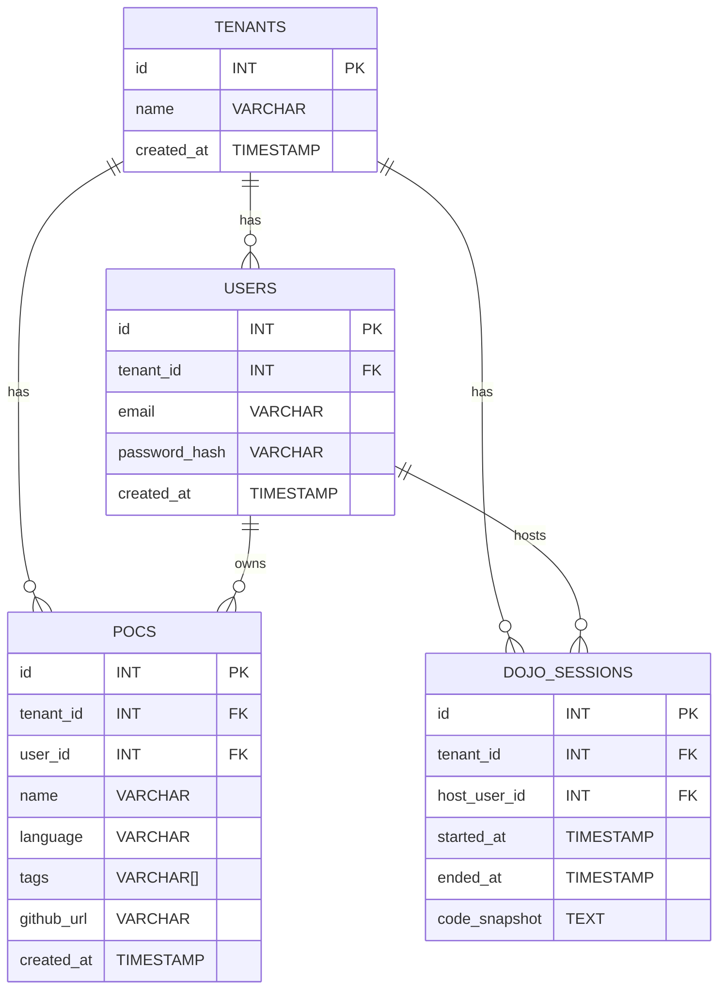

## 🏛️ Structure

### 1. 🎯 Problem Statement and Context

Mr. Bill wants a system to keep track of his favorite POCs (Proofs of Concept). 
The system must be a mobile app (native, not hybrid) where users can register POCs (with Github URL, name, language, tags), search/filter them, and generate reports. 
The system must be multi-tenant, secure, and support login. 
Mr. Bill will sell this system to multiple customers in Brazil. 
Additionally, the system must generate a video summary of a user's POCs from the last year and support "Realtime Dojos" (collaborative coding sessions, similar to VSCode Live Share). 
The solution must avoid Lambda, monoliths, single AZ, MongoDB, and non-AWS clouds. 
The mobile app must be native (not Ionic or hybrid), and only one relational DB is allowed.

### 2. 🎯 Goals

1. Native mobile app (iOS or Android, not hybrid) for best performance and user experience.
2. Multi-tenant: Each customer has isolated data and authentication.
3. Secure authentication and authorization (OAuth2, JWT, password policies).
4. CRUD for POCs: Register, update, delete, search by name/language/tags.
5. Report generation: Downloadable reports (PDF/CSV) via API.
6. Video generation: Endpoint to generate a video summary of user's POCs from the last year.
7. Realtime Dojos: Collaborative coding sessions (text/video chat, shared code editor).
8. Scalable, highly available (multi-AZ, AWS managed services).
9. No serverless Lambda, no monoliths, no MongoDB, no non-AWS clouds.
10. Observability: Logging, metrics, and alerting for all key operations.

### 3. 🎯 Non-Goals

1. No hybrid/mobile-web (Ionic) app.
2. No multi-language mobile codebase (choose either Swift/Kotlin).
3. No serverless Lambda functions.
4. No monolithic backend.
5. No single-AZ deployments.
6. No MongoDB or other NoSQL DBs.
7. No non-AWS cloud providers.
8. No support for desktop/web clients.
9. No support for non-Github POCs.
10. No advanced AI/ML features (beyond video generation).

### 4. 📐 Principles

1. Low coupling, high cohesion between services.
2. Security by design: all endpoints authenticated, encrypted in transit and at rest.
3. Multi-tenancy: strict data isolation per tenant.
4. Observability: all actions logged, metrics for usage and errors.
5. Testability: automated tests for all components.
6. Scalability: stateless services, auto-scaling groups.
7. High availability: multi-AZ deployments, managed AWS services.
8. Extensibility: easy to add new features (e.g., new report types).
9. Cost efficiency: use managed AWS services, avoid over-provisioning.
10. User experience: fast, responsive native app.

### 5. 🏗️ Overall Diagrams

#### 🗂️ 5.1 Overall Architecture

*Layered system component diagram: each service is a separate box, and arrows connect only the main layers (subgraphs), not individual services.*

#### 🗂️ 5.2 Deployment

*Deployment diagram: all backend services in ECS, multi-AZ Aurora, S3, Cognito, CloudWatch.*

#### 🗂️ 5.3 Use Cases

*User interaction flow for main use cases.*

##### 7.3 Persistence Model

*ER diagram for Aurora PostgreSQL persistence model.*

### 6. 🧭 Trade-offs

#### Major Decisions
1. Native mobile app (Kotlin/Swift) vs. hybrid (Ionic)
2. Microservices on ECS vs. Lambda/serverless
3. Aurora PostgreSQL vs. MongoDB
4. AWS Cognito vs. custom auth
5. ECS for video/report generation vs. Lambda

#### Trade-offs

##### 1. Native vs. Hybrid
PROS: Best performance, native UX, access to device features.

CONS: Higher development cost, two codebases if both platforms needed.

##### 2. ECS vs. Lambda
PROS: No cold starts, better for long-running/report/video jobs, fits restriction.

CONS: More ops overhead than Lambda.

##### 3. Aurora vs. MongoDB
PROS: Strong consistency, ACID, fits restriction.

CONS: Less flexible for unstructured data.

##### 4. Cognito vs. Custom Auth
PROS: Secure, managed, multi-tenant support.

CONS: Some learning curve, less customizable.

##### 5. ECS for video/report
PROS: Handles heavy/long-running jobs, scalable.

CONS: Slightly more expensive than Lambda for short jobs

### 7. 🌏 For each key major component

##### 7.1 Mobile App
* Native (Kotlin or Swift)
* Screens: Login, Register, POC List/Search, POC Detail, Report Download, Video Download, Realtime Dojo
* Integrates with backend via REST/WebSocket
##### 7.2 Backend Services
* Auth Service: Integrates with Cognito
* POC Service: CRUD for POCs, multi-tenant aware
* Report Service: Generates PDF/CSV, stores in S3
* Video Service: Generates video (ffmpeg), stores in S3
* Realtime Dojo Service: WebSocket, manages sessions, code sharing
##### 7.3 Persistence Model
* Aurora PostgreSQL
* Tenants Table
* Users Table (tenant_id FK)
* POCs Table (tenant_id FK, user_id FK, name, language, tags, github_url, created_at)
* Dojo Sessions Table (tenant_id FK, session_id, participants, code_snapshot, started_at)
##### 7.4 Algorithms/Data Structures
* Video Generation: ffmpeg script to create slideshow/video from POC metadata/screenshots
* Report Generation: SQL queries for POC stats, export to PDF/CSV
* Realtime Dojo: WebSocket message broker, code diff/merge logic

### 🖹 8. Migrations

* Use Flyway or Liquibase for DB migrations.
* Zero-downtime: deploy new schema, migrate data in background.
* Versioned migration scripts, rollback support.

### 🖹 9. Testing strategy

* Unit tests for all backend services (JUnit/Jest)
* Integration tests for API endpoints
* UI tests for mobile app (Espresso/XCTest)
* Load tests for report/video endpoints
* Security tests: auth, multi-tenant isolation
* Chaos testing for ECS/Aurora failover

### 🖹 10. Observability strategy

* CloudWatch logs for all services
* X-Ray(IA) tracing for API calls
* Custom metrics: POCs created, reports/videos generated, dojo sessions
* Alerts for errors, high latency, failed jobs
* Dashboards for usage and error rates

### 🖹 11. Data Store Designs

* Aurora PostgreSQL
* Tenants: id, name, created_at
* Users: id, tenant_id, email, password_hash, created_at
* POCs: id, tenant_id, user_id, name, language, tags (array), github_url, created_at
* Dojo Sessions: id, tenant_id, host_user_id, started_at, ended_at, code_snapshot

S3

* /reports/{tenant_id}/{user_id}/{report_id}.pdf
* /videos/{tenant_id}/{user_id}/{year}.mp4

### 🖹 12. Technology Stack

* Mobile: Kotlin (Android) or Swift (iOS)
* Backend: Spring Boot (Java/Kotlin) or Node.js (TypeScript)
* DB: Amazon Aurora PostgreSQL (multi-AZ)
* Auth: AWS Cognito
* Object Storage: AWS S3
* Container Orchestration: AWS ECS Fargate
* Realtime: WebSocket service on ECS
* Video/Report: ffmpeg, PDFKit, running in ECS
* Monitoring: CloudWatch, X-Ray
* CI/CD: GitHub Actions, AWS CodePipeline

### 🖹 13. References

* AWS Well-Architected Framework: https://aws.amazon.com/architecture/well-architected/
* AWS Multi-Tenant SaaS Patterns: https://aws.amazon.com/partners/saas-factory/saas-architecture/
* AWS Cognito Documentation: https://docs.aws.amazon.com/cognito/latest/developerguide/cognito-user-identity-pools.html
* AWS Aurora Documentation: https://docs.aws.amazon.com/aurora/latest/userguide/aurora-overview.html
* AWS ECS Fargate: https://docs.aws.amazon.com/AmazonECS/latest/developerguide/AWS_Fargate.html
* AWS S3 Documentation: https://docs.aws.amazon.com/s3/index.html
* AWS CloudWatch: https://docs.aws.amazon.com/cloudwatch/
* AWS X-Ray: https://docs.aws.amazon.com/xray/latest/devguide/aws-xray.html
* ffmpeg Documentation: https://ffmpeg.org/documentation.html
* Spring Boot Documentation: https://spring.io/projects/spring-boot
* Node.js Documentation: https://nodejs.org/en/docs/
* PostgreSQL Documentation: https://www.postgresql.org/docs/
* Flyway: https://flywaydb.org/documentation/
* Liquibase: https://www.liquibase.org/docs/index.html
* 12 Factor App: https://12factor.net/
* REST API Design: https://blog.stoplight.io/api-design-patterns-for-rest-web-services
* Enterprise Integration Patterns: https://www.enterpriseintegrationpatterns.com/
* SOA Patterns: https://patterns.arcitura.com/soa-patterns
* Microservice API Patterns: https://microservice-api-patterns.org/
* Software Development Anti-Patterns: https://sourcemaking.com/antipatterns/software-development-antipatterns
* Refactoring Patterns: https://sourcemaking.com/refactoring/refactorings
* Database Refactoring Patterns: https://databaserefactoring.com/
* Cloud Design Patterns: https://docs.aws.amazon.com/prescriptive-guidance/latest/cloud-design-patterns/introduction.html
* Relational DB Patterns: https://www.geeksforgeeks.org/design-patterns-for-relational-databases/
* Rendering Patterns: https://www.patterns.dev/vanilla/rendering-patterns/
