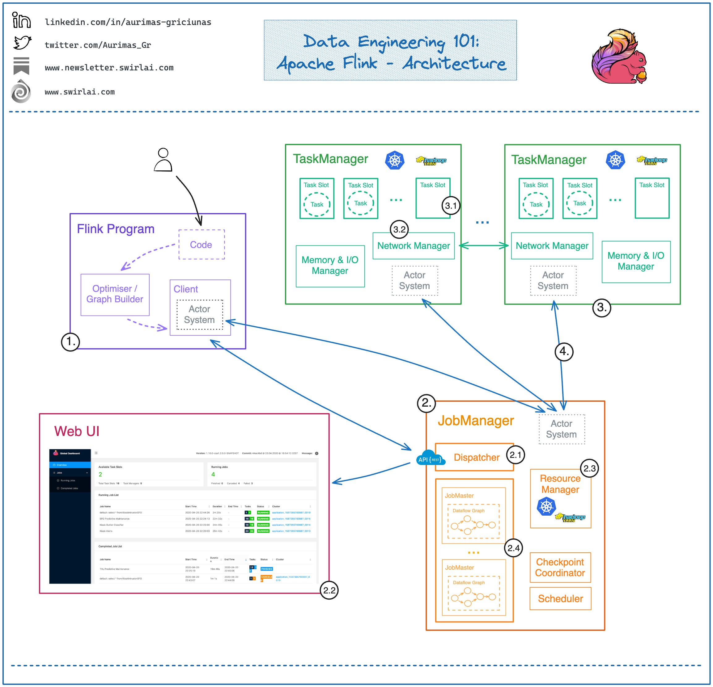
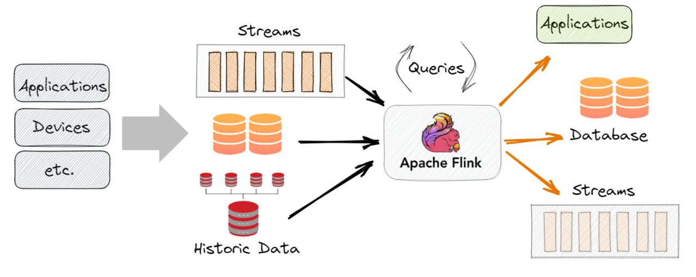
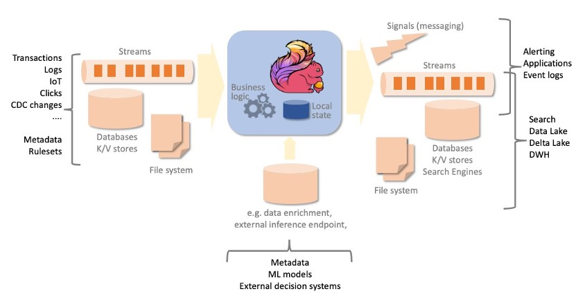

# Apache Flink: Architecture and Core Functionality

This document visually explains how Apache Flink works, from its basic architecture to advanced stream processing concepts.

## 1. Basic Flink Architecture

Apache Flink's architecture consists of two main components that work together to execute distributed data processing applications.

### JobManager (Coordinator)

- Acts as the brain of the Flink cluster
- Coordinates distributed execution, task scheduling, checkpoint management, and failure recovery
- Receives the execution graph when a job is submitted
- Divides the execution graph into parallel tasks and distributes them among available TaskManagers
- Maintains the global state of the job (which tasks are running, where, and processing progress)
- In high-availability mode, multiple JobManagers can run (one active leader, others on standby for failover)

### TaskManager (Executors)

**TaskManagers** are the workers that execute the actual data processing tasks. Each TaskManager has multiple task slots that can execute different operators from the processing pipeline. TaskManagers manage network buffers for data exchange, maintain local state of operations, and execute user code.

Communication between TaskManagers is optimized to minimize latency and maximize throughput. Data flows directly between TaskManagers through dedicated network connections, avoiding centralized bottlenecks.

### Execution Flow

When a client submits a job, the following flow occurs:

1. The **Client** compiles user code and generates an execution graph (JobGraph)
2. The graph is sent to the **JobManager** via the **Dispatcher**
3. The JobManager optimizes the graph and transforms it into a physical execution graph
4. Tasks are distributed to available **TaskManagers**
5. TaskManagers execute tasks and exchange data among themselves
6. Results are sent to configured sinks

## 2. Detailed Architecture and Components

This image shows a more detailed view of Flink's internal components and how they interact.

### Architecture Layers

**Deploy Layer**: Flink can be deployed in various environments, including standalone clusters, YARN, Kubernetes, Mesos, and cloud-managed services. This flexibility allows Flink to adapt to an organization's existing infrastructure.

**Runtime Layer**: This is the distributed processing engine that executes data flow graphs. The runtime manages task execution, data exchange between operators, memory management, and distributed coordination.

**API Layer**: Flink offers multiple APIs at different abstraction levels:

- **DataStream API**: For low-latency stream processing
- **DataSet API**: For batch processing (being unified with DataStream)
- **Table API**: Declarative SQL-like API for relational operations
- **SQL**: Full ANSI SQL support for queries on streams and batch

### State Management

Flink maintains operation state in a distributed and fault-tolerant manner. State can be stored in different backends:

- **Memory State Backend**: Stores state in JVM heap (for development)
- **FsStateBackend**: Stores state in distributed file system
- **RocksDB State Backend**: Uses RocksDB for state exceeding available memory

### Checkpointing and Fault Tolerance

Flink implements the **Chandy-Lamport** algorithm to create consistent snapshots of distributed state. Periodically, the JobManager initiates a checkpoint that captures the state of all operators and positions in sources. In case of failure, Flink restores state from the last successful checkpoint and resumes processing.

## 3. Application Models: Traditional vs Event-Driven

This image illustrates the fundamental difference between traditional transaction-based applications and event-driven applications built with Flink.

### Traditional Applications

In the traditional model, applications interact with transactional databases synchronously. Each operation reads data, processes it, and writes results back to the database. This model has limitations:

- **Latency**: Each operation requires round-trips to the database
- **Scalability**: The database becomes a bottleneck
- **Coupling**: Business logic is tightly coupled to storage

### Event-Driven Applications with Flink

Flink enables building applications that react to event streams in real-time. Events flow through stateful operators that maintain state locally, eliminating the need for constant database queries.

**Advantages of the event-driven model**:

- **Low Latency**: In-memory processing with millisecond latency
- **High Throughput**: Capability to process millions of events per second
- **Consistency**: Local state with consistent snapshots via checkpointing
- **Scalability**: Horizontal parallelization without centralized bottlenecks

Event-driven applications maintain the necessary state for processing locally in TaskManagers, accessing persistent storage only for checkpoints and failure recovery.

## 4. Data Ecosystem Integration

Flink integrates with a wide variety of data systems, functioning as a unified processing layer.

### Sources (Data Sources)

Flink can ingest data from multiple sources simultaneously:

- **Message Queues**: Kafka, RabbitMQ, Pulsar
- **Databases**: PostgreSQL (CDC), MySQL, MongoDB
- **File Systems**: HDFS, S3, local filesystem
- **APIs**: REST APIs, WebSockets
- **IoT**: MQTT, connected devices

### Processing in Flink

Once data enters Flink, it flows through a graph of operators that implement business logic. Operators can perform:

- **Transformations**: Map, filter, flatMap
- **Aggregations**: Reduce, sum, count, window aggregations
- **Joins**: Stream-stream joins, stream-table joins
- **Pattern Detection**: CEP (Complex Event Processing)
- **Machine Learning**: Integration with ML frameworks

### Sinks (Data Destinations)

Processed results can be sent to various destinations:

- **Databases**: PostgreSQL, MySQL, Cassandra, Elasticsearch
- **Data Lakes**: S3, HDFS, Delta Lake
- **Message Queues**: Kafka, Kinesis
- **APIs**: REST endpoints, webhooks
- **Dashboards**: Grafana, Kibana

This flexibility allows Flink to act as the central data processing hub, connecting legacy systems with modern architectures.

## 5. Simplified Data Flow

This simplified visualization shows how data flows through a typical Flink application.

### Processing Pipeline

1. **Ingestion**: Data arrives from multiple sources (databases, APIs, files)
2. **Transformation**: Operators apply business logic to data
3. **Aggregation**: Data is grouped and aggregated using windows
4. **Enrichment**: Data is enriched with information from other sources
5. **Output**: Results are written to databases, streams, or files

### Parallelization

Each operator in the pipeline can be parallelized independently. Flink divides the input stream into multiple partitions that are processed in parallel by different operator instances. This allows horizontal scaling of processing by adding more TaskManagers to the cluster.

### Processing Guarantees

Flink offers three levels of guarantees:

- **At-most-once**: Each event is processed at most once (may have loss)
- **At-least-once**: Each event is processed at least once (may have duplication)
- **Exactly-once**: Each event is processed exactly once (no loss or duplication)

Most applications use exactly-once to guarantee result consistency.

## 6. Reference Architecture

This image shows a reference architecture for modern data processing systems using Flink.

### Architecture Layers

**Ingestion Layer**: Collects data from various sources using specialized connectors. This layer handles different formats, protocols, and access patterns.

**Processing Layer (Flink)**: The heart of the system where business logic is executed. This layer is stateful, fault-tolerant, and horizontally scalable.

**Storage Layer**: Stores both operational state (for recovery) and processed results (for queries). State is stored in distributed systems like S3 or HDFS, while results go to databases or data lakes.

**Serving Layer**: Exposes processed data through APIs, dashboards, and BI tools for consumption by applications and end users.

### Usage Patterns

**Lambda Architecture**: Combines batch and stream processing to balance latency and completeness. Flink can implement both layers with the same API.

**Kappa Architecture**: Uses only stream processing, simplifying the architecture. Flink is ideal for this pattern due to its unified batch and stream model.

**Event Sourcing**: Stores all events and reconstructs state through reprocessing. Flink can process event logs and maintain updated materialized views.

## 7. Batch vs Streaming Analytics

This comparison illustrates the fundamental differences between traditional batch processing and streaming analytics with Flink.

### Batch Analytics (Left)

In traditional batch processing, data is collected over time, stored in a data warehouse, and processed periodically (daily, hourly). This model has specific characteristics:

**High Latency**: Results are available only after complete batch processing, resulting in latencies from minutes to hours.

**High Throughput**: Batch processing can optimize for maximum throughput, processing large data volumes at once.

**Eventual Consistency**: Results reflect the state of data at processing time, not the current state.

**Use Cases**: Daily reports, historical analysis, batch ETL, ML model training.

### Streaming Analytics (Right)

Flink enables continuous processing of real-time data, where each event is processed as soon as it arrives.

**Low Latency**: Results available in milliseconds to seconds after events occur.

**Continuous Processing**: No concept of "batch", processing never stops.

**Updated State**: Results always reflect the most recent state of data.

**Use Cases**: Real-time fraud detection, system monitoring, personalized recommendations, operational alerts.

### Unification in Flink

Flink treats batch as a special case of streaming (finite stream). This means the same API and code can be used for both cases, simplifying development and maintenance.

## Key Flink Concepts

### Streams and Transformations

In Flink, everything is a stream. A stream is a potentially infinite sequence of events. Transformations are operations applied to streams that produce new streams.

**Basic Transformations**:
- `map()`: Transforms each element individually
- `filter()`: Removes elements that don't meet a condition
- `flatMap()`: Transforms each element into zero or more elements
- `keyBy()`: Partitions the stream by a key

**Aggregation Transformations**:
- `reduce()`: Combines elements using a reduction function
- `aggregate()`: Custom aggregation with accumulator
- `window()`: Groups elements into temporal or count-based windows

### Windows

Windows allow grouping events for aggregation. Flink supports several window types:

**Tumbling Windows**: Fixed-size windows without overlap (e.g., 1-hour windows)

**Sliding Windows**: Fixed-size windows that slide by a smaller interval (e.g., 1-hour window sliding every 15 minutes)

**Session Windows**: Windows based on inactivity periods (e.g., user sessions)

**Global Windows**: Single window containing all elements

### Time Semantics

Flink supports three time concepts:

**Event Time**: The time when the event actually occurred (timestamp in the event)

**Processing Time**: The time when the event is processed by Flink

**Ingestion Time**: The time when the event enters Flink

Event time is most commonly used to guarantee correct results even with out-of-order or delayed events.

### Watermarks

Watermarks are special markers that flow in the stream indicating event time progress. They allow Flink to know when it's safe to close a window and emit results, even with delayed events.

## Apache Flink Advantages

### Performance and Scalability

Flink was designed from the ground up for high performance and horizontal scalability. Contributing characteristics:

- **In-memory processing**: Minimizes I/O and latency
- **Pipelining**: Operators process data continuously without intermediate materialization
- **Efficient parallelization**: Automatic load distribution among TaskManagers
- **Optimized network stack**: Low-latency data transfer between operators

### Fault Tolerance

Flink's checkpointing mechanism ensures applications can recover from failures without data loss:

- **Consistent snapshots**: Chandy-Lamport algorithm for distributed snapshots
- **Fast recovery**: State restoration from checkpoints
- **Exactly-once semantics**: Guarantee of correct processing even with failures

### Flexibility

Flink offers flexibility in multiple dimensions:

- **Multi-level APIs**: From low-level (ProcessFunction) to high-level (SQL)
- **Deployment options**: Standalone, YARN, Kubernetes, cloud managed services
- **State backends**: Memory, filesystem, RocksDB
- **Connectors**: Wide ecosystem of sources and sinks

## Practical Use Cases

### Real-Time Fraud Detection

Financial institutions use Flink to detect fraudulent transactions in real-time. The system analyzes transaction patterns, compares with behavior profiles, and generates alerts in milliseconds when detecting anomalies.

### Infrastructure Monitoring

Technology companies use Flink to process logs and metrics from thousands of servers in real-time, detecting problems before they affect end users.

### Personalized Recommendations

E-commerce and streaming platforms use Flink to process user events in real-time and update recommendations instantly based on current behavior.

### IoT and Sensor Analysis

Industries use Flink to process data from millions of IoT sensors, detecting equipment anomalies and enabling predictive maintenance.

## Conclusion

Apache Flink represents the state of the art in distributed stream processing. Its robust architecture, flexible APIs, and processing guarantees make it the ideal choice for applications requiring real-time data processing with high reliability.

The images presented in this document illustrate different aspects of Flink's architecture, from basic components to advanced usage patterns. Understanding these concepts is fundamental for designing and implementing efficient and scalable data pipelines.
