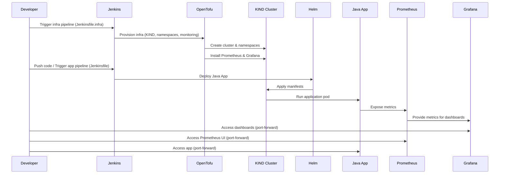

# Automated Deployment System

This project implements a deployment system using:
- Jenkins (CI/CD)
- Helm (application deployment)
- OpenTofu (infrastructure as code)
- KIND (local Kubernetes cluster)
- Prometheus & Grafana (monitoring)
- Java application in the app/ directory

## Architecture Sequence Diagram

Below is a sequence diagram illustrating the main connections and flow between components. **Infrastructure provisioning is a one-time setup, while application deployment is repeatable and independent.**



## Structure
- **Jenkinsfile**: CI/CD pipeline for building, testing, and deploying applications.
- **Jenkinsfile.infra**: Jenkins pipeline for provisioning infrastructure (cluster, namespaces, Prometheus, Grafana) via OpenTofu.
- **helm/app**: Helm chart for deploying applications with built-in monitoring integration.
- **infra/**: OpenTofu scripts to provision the cluster, namespaces, and install Prometheus/Grafana.
- **docker-compose.yml**: Runs Helm and Docker Registry for local development. KIND is provisioned via OpenTofu, not via Compose.
- **app/**: Java application source code and Dockerfile.

## How it works
1. **Provisioning**
   - Use the Jenkins job defined in `Jenkinsfile.infra` to provision the Kubernetes cluster (KIND), namespaces (`infra` and `apps`), and install Prometheus/Grafana using OpenTofu.
   - For local development, use Docker Compose to run Helm and the Docker Registry. KIND is created via OpenTofu.

2. **Jenkins Pipeline**
   - The main Jenkinsfile checks out code, builds, runs automated tests (pipeline fails if tests fail), builds/pushes the Docker image for the Java app in `app/`.
   - Deployment is done via Helm using the chart in `helm/app`.

3. **Application Deployment**
   - Use Helm to install applications in the `apps` namespace.
---
## Accessing the KIND Cluster

After provisioning the cluster with OpenTofu, the kubeconfig will be available at `c:\kubeconfig\kubeconfig.yaml`.

To connect to the KIND cluster and view resources, use the following commands:

```sh
kubectl --kubeconfig=c:\kubeconfig\kubeconfig.yaml get nodes
kubectl --kubeconfig=c:\kubeconfig\kubeconfig.yaml get all --all-namespaces
```

To export your application's service port for local access, use:
```sh
kubectl --kubeconfig=c:\kubeconfig\kubeconfig.yaml port-forward -n apps svc/<your-app-service-name> <local-port>:<service-port>
```
Replace `<your-app-service-name>`, `<local-port>`, and `<service-port>` with your app's service name and desired ports.

---

## Accessing Grafana, Prometheus and App

Grafana and Prometheus services are exposed as ClusterIP by default. To access them in your browser, use port-forward:

**Grafana:**
```sh
kubectl --kubeconfig=c:\kubeconfig\kubeconfig.yaml port-forward -n infra svc/grafana 3000:80
```
Access: http://localhost:3000

**Prometheus:**
```sh
kubectl --kubeconfig=c:\kubeconfig\kubeconfig.yaml port-forward -n infra svc/prometheus-server 4000:80
```
Access: http://localhost:4000

**App:**
```sh
kubectl --kubeconfig=c:\kubeconfig\kubeconfig.yaml port-forward -n apps svc/java-app 8080:80
```
Access: http://localhost:8080

To list infra services and ports:
```sh
kubectl --kubeconfig=c:\kubeconfig\kubeconfig.yaml get svc -n infra
```

To list apps services and ports:
```sh
kubectl --kubeconfig=c:\kubeconfig\kubeconfig.yaml get svc -n apps
```

---

## Tools Used

- **Jenkins**: Automation server for CI/CD pipelines. Integrates with source control, builds, tests, and deploys applications.
  - **Pros:**
    - Highly extensible
    - Large plugin ecosystem
    - Supports complex workflows
    - Integrates with many tools
  - **Cons:**
    - Can be complex to configure
    - UI can be slow
    - Requires maintenance and updates


- **Helm**: Kubernetes package manager for deploying applications as charts.
  - **Pros:**
    - Simplifies Kubernetes deployments
    - Supports templating
    - Easy upgrades/rollbacks
  - **Cons:**
    - Learning curve for templating
    - Debugging chart issues can be tricky


- **OpenTofu (Terraform fork)**: Infrastructure as code tool for provisioning cloud and local resources, including KIND clusters.
  - **Pros:**
    - Declarative, reproducible infrastructure
    - Supports many providers
    - Easy to version control
  - **Cons:**
    - State management can be complex
    - Error messages sometimes unclear


- **KIND (Kubernetes IN Docker)**: Tool for running local Kubernetes clusters using Docker containers.
  - **Pros:**
    - Fast local clusters
    - Easy to use for development/testing
    - Integrates with CI/CD
  - **Cons:**
    - Not suitable for production
    - Networking differs from real clusters
    - NodePort access may require extra config


- **Prometheus**: Monitoring and alerting toolkit, collects metrics from applications and infrastructure.
  - **Pros:**
    - Powerful querying
    - Integrates with Grafana
    - Auto-discovers targets via annotations
  - **Cons:**
    - Requires configuration for custom metrics
    - Storage can grow quickly


- **Grafana**: Visualization platform for metrics, logs, and dashboards.
  - **Pros:**
    - Rich dashboard ecosystem
    - Supports many data sources
    - Easy to use
  - **Cons:**
    - Some advanced features require paid version
    - Dashboard provisioning can be complex


- **Docker**: Containerization platform for building, shipping, and running applications.
  - **Pros:**
    - Consistent environments
    - Easy to share images
    - Integrates with CI/CD
  - **Cons:**
    - Requires Docker daemon
    - Image size can grow if not optimized

## Pipeline and Provisioning Logs

For detailed example logs and outputs from Jenkins, OpenTofu, Docker, Helm, and Kubernetes, see the [LOGS.md](LOGS.md) file.
