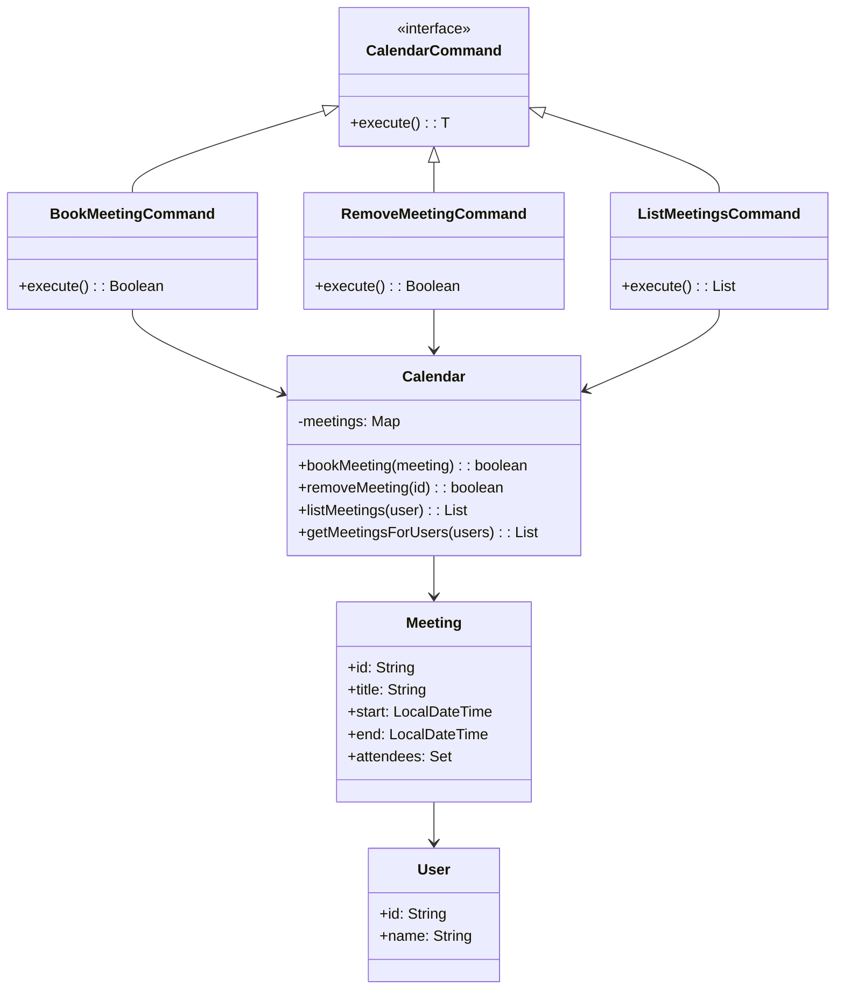

# Calendar System

## Overview

This project implements a **meeting scheduling system** using the **Command Pattern**. It supports booking meetings, detecting conflicts, managing attendees, and ensuring no double-booking occurs.

## Tech Stack

- **Java 21** → Modern Java with records and enhanced features
- **Gradle** → Build tool
- **JUnit 5** → Testing framework

## Features

- **Command Pattern** → All calendar operations as commands
- **Conflict Detection** → Prevents double-booking of attendees
- **Multi-User Support** → Manage meetings for multiple users
- **Meeting Management** → Book, remove, and list meetings
- **Time Slot Validation** → Automatic overlap checking

## Architecture



## Command Pattern

The **Command Pattern** provides flexible calendar operations:

- Each calendar action is a command
- Commands are executed through an invoker
- Easy to add new operations (suggest time, reschedule, etc.)
- Clean separation between request and execution

## Setup Instructions

### 1 - Clone the Repository
```bash
git clone https://github.com/rbleggi/tech-pocs.git
cd java/calendar
```

### 2 - Build & Run the Application
```bash
./gradlew build
./gradlew run
```

### 3 - Run Tests
```bash
./gradlew test
```