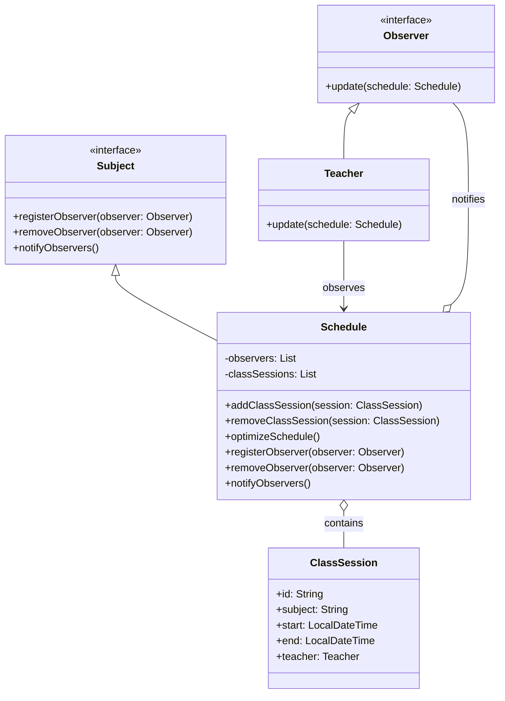

# **Teacher's Class Organizer/Optimizer (Java)**

## Overview

This project implements a **flexible and maintainable class organizer/optimizer** for teachers using the **Observer Pattern** in **Java**. Teachers and admins are notified of schedule changes, and the system helps optimize class allocations.

## Tech Stack

- **Java 21** → Modern Java with records and pattern matching.
- **Gradle** → Build tool for JVM projects.

## Architecture Diagram



## Setup Instructions

### 1 - Clone the Repository

```bash
git clone https://github.com/rbleggi/tech-pocs.git
cd java/class-organizer
```

### 2 - Compile & Run the Application

```bash
./gradlew build
./gradlew run
```

### 3 - Run Tests

```bash
./gradlew test
```
