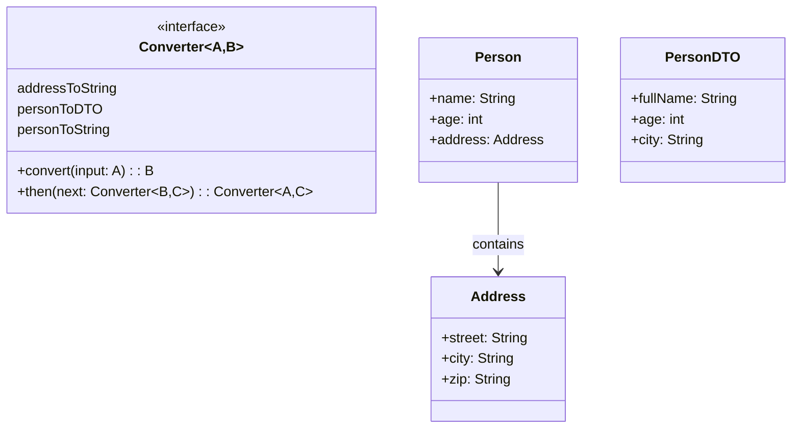

# **Converter Framework**

## Overview

This project implements a flexible type conversion framework using functional interfaces and composition. The system follows the Adapter Pattern, enabling type-safe conversions between complex types through a chainable converter pipeline.

---

## Tech Stack

- **Java 25** → Modern Java with records and functional interfaces.
- **Gradle** → Build tool.
- **JDK 25** → Required to run the application.

---

## Architecture Diagram



---

## Setup Instructions

### 1 - Clone the Repository
```bash
git clone https://github.com/rbleggi/tech-pocs.git
cd java/converter-framework
```

### 2 - Compile & Run the Application
```bash
./gradlew build run
```

### 3 - Run Tests
```bash
./gradlew test
```
