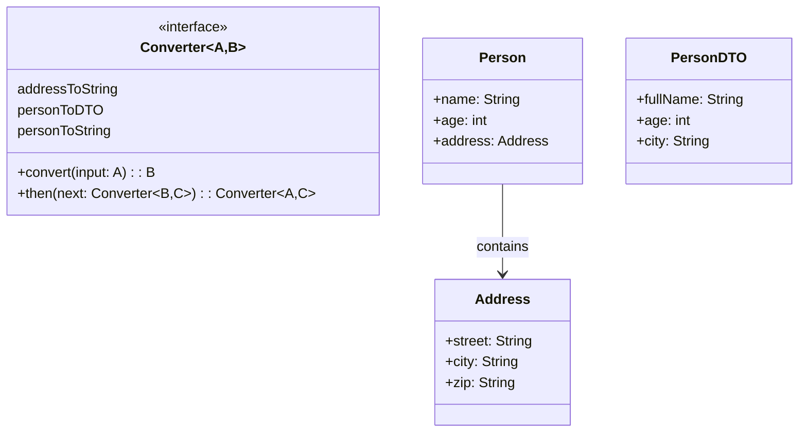

# Converter Framework

## Overview

This project implements a **flexible type conversion framework** using **functional interfaces and composition**. The system follows the **Adapter Pattern**, enabling **type-safe conversions** between complex types through a **chainable converter pipeline**.

## Tech Stack

- **Java 21** → Modern Java with records and functional interfaces
- **Gradle** → Build tool
- **JUnit 5** → Testing framework

## Features

- **Functional Interface** → Clean, composable converter abstraction
- **Converter Composition** → Chain converters using `then()` method
- **Type-Safe Conversions** → Compile-time type checking between complex types
- **Chainable Pipeline** → Build conversion workflows declaratively
- **No Reflection** → Pure functional approach with zero runtime overhead

## Architecture



## Adapter Pattern

The **Adapter Pattern** is used to **convert interfaces between incompatible types**. This implementation:
- **Uses `Converter<A, B>` as a functional interface** for type conversion
- **Implements `then()` for composition**, enabling converter chaining
- **Delegates conversion responsibility to each converter**, ensuring **encapsulation**
- **Enables pipeline construction** without modifying existing converters

## Setup Instructions

### 1 - Clone the Repository
```bash
git clone https://github.com/rbleggi/tech-pocs.git
cd java/converter-framework
```

### 2 - Build & Run the Application
```bash
./gradlew build
./gradlew run
```

### 3 - Run Tests
```bash
./gradlew test
```
