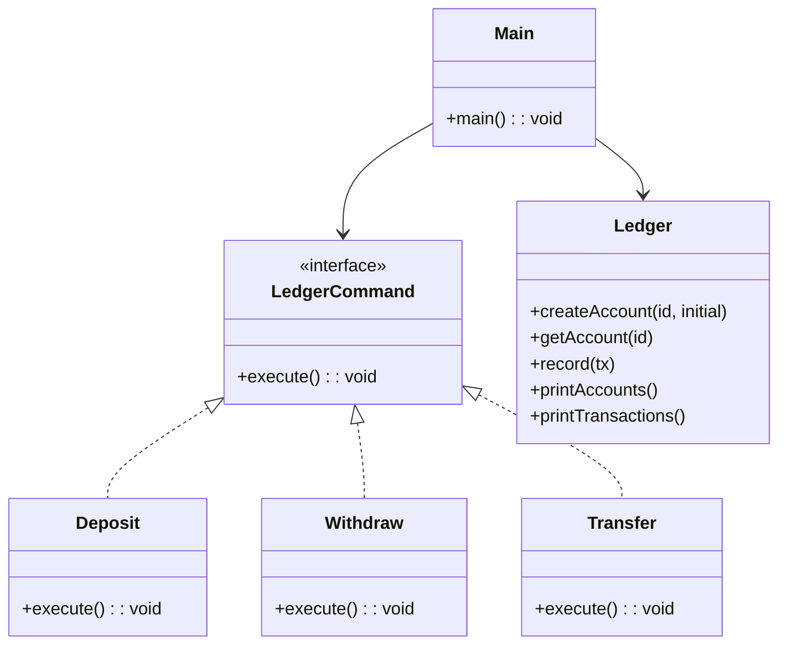

# **Core Bank Ledger**

## Overview

This project implements a simple Core Bank Ledger using the Command Pattern in Java. It demonstrates basic banking operations (deposit, withdraw, transfer) with an extensible and testable design, all in a single file for proof-of-concept purposes.

---

## Tech Stack

- **Java 25** → Modern Java with records and pattern matching.
- **Gradle** → Build automation tool.
- **JDK 25** → Required to run the application.

---

## Architecture Diagram



---

## Setup Instructions

### 1 - Clone the Repository

```bash
git clone https://github.com/rbleggi/tech-pocs.git
cd java/core-bank-ledger
```

### 2 - Compile & Run the Application

```bash
./gradlew build run
```

### 3 - Run Tests

```bash
./gradlew test
```
