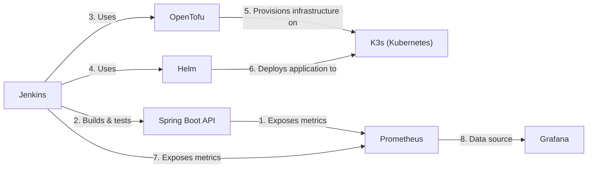

# DevOps Deployment System

This project implements a comprehensive deployment system with a Spring Boot API and various DevOps tools for continuous integration, deployment, and monitoring.

## Quick Start

1. Clone the repository:
    ```sh
    git clone https://github.com/yourusername/devops-deployment-system.git
    cd devops-deployment-system
    ```

2. Configure your platform (Windows/Mac):
    - See [Platform-Specific Configuration](docs/platform-config.md)

3. Start all services:
    ```sh
    docker-compose up -d --build
    ```

4. Access the services:
    - Spring Boot API: [http://localhost:8080](http://localhost:8080)
    - Jenkins: [http://localhost:8081](http://localhost:8081)
    - Prometheus: [http://localhost:9090](http://localhost:9090)
    - Grafana: [http://localhost:3000](http://localhost:3000)

## System Architecture



## Documentation

Detailed documentation is available in the `docs` directory:

- [API Documentation](docs/api.md) - Information about the Spring Boot API
- [System Architecture](docs/architecture.md) - Overview of the system architecture and component details
- [Docker Compose Implementation](docs/docker-compose.md) - How to run the system using Docker Compose
- [Kubernetes Deployment](docs/kubernetes.md) - Information about the Kubernetes deployment
- [Platform-Specific Configuration](docs/platform-config.md) - Configuration instructions for Windows and Mac
- [Application Configuration](docs/application-config.md) - How to configure and integrate the applications

## Components

This system includes the following components:

- **Spring Boot API**: A simple REST API built with Java 21 and Spring Boot 3.2.0
- **Jenkins**: Automation server for CI/CD pipelines
- **Helm**: Kubernetes package manager for deploying applications
- **OpenTofu**: Infrastructure as Code tool (fork of Terraform)
- **K3s**: Lightweight Kubernetes distribution
- **Prometheus**: Time-series database for metrics collection
- **Grafana**: Visualization platform for metrics and logs

## Troubleshooting

### Connection Issues

If you encounter connection issues with Kubernetes, Helm, or OpenTofu, ensure:

1. The k3s service is running:
   ```sh
   docker-compose ps k3s
   ```

2. The kubeconfig.yaml file is correctly configured to use `https://k3s:6443` as the server URL

3. Your hosts file is configured to map `k3s` to `127.0.0.1` (see [Platform-Specific Configuration](docs/platform-config.md))

4. The Docker Compose network is working properly:
   ```sh
   docker network inspect devops_app-network
   ```

### Checking Logs

To check logs for any service:

```sh
docker-compose logs [service_name]
```

For example:
```sh
docker-compose logs k3s
docker-compose logs helm
docker-compose logs opentofu
```
