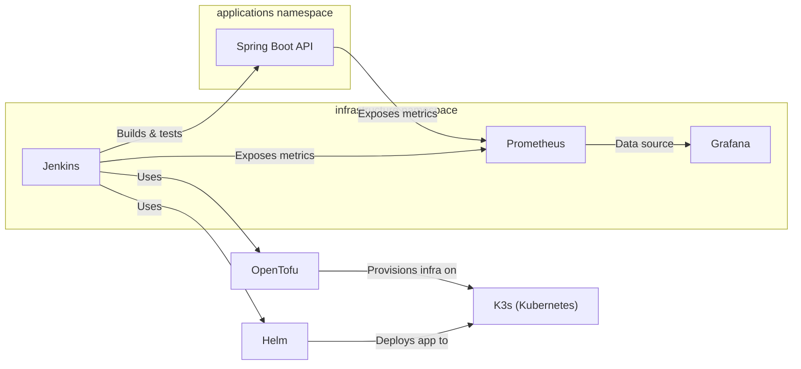

# DevOps Deployment System

A modern deployment system for Spring Boot applications using Jenkins, Helm, OpenTofu, Kubernetes, Prometheus, and Grafana. Provides automated CI/CD, infrastructure provisioning, and monitoring with clear separation between infrastructure and application workloads.

---

## Features

- **Jenkins**: CI/CD pipeline for building, testing, and deploying applications. Pipelines run tests and fail on errors.
- **Helm**: Manages application deployments to Kubernetes.
- **OpenTofu**: Infrastructure as Code for provisioning Kubernetes resources and namespaces.
- **Kubernetes (K3s/Minikube)**: Container orchestration. Two namespaces: one for infrastructure, one for applications.
- **Prometheus**: Monitoring and metrics collection. All deployed apps are scraped by Prometheus by default.
- **Grafana**: Visualization and dashboards. All apps are integrated with Grafana dashboards by default.

---

## System Architecture

### Namespace Separation

- **infrastructure**: Jenkins, Prometheus, Grafana, and platform services.
- **applications**: User applications deployed via Helm.

This separation improves security and manageability.

### Architecture Diagram



---

## Component Details

- **Spring Boot API**: Java 21, Spring Boot 3.2.0, exposes Prometheus metrics.
- **Jenkins**: Orchestrates build, test, and deployment. Pipelines fail on test errors.
- **OpenTofu**: Provisions infra and namespaces in Kubernetes.
- **Helm**: Deploys apps to the `applications` namespace.
- **Prometheus**: Scrapes metrics from all apps and Jenkins.
- **Grafana**: Dashboards for all deployed apps, provisioned automatically.

---

## Deployment Flow

1. Jenkins pipeline runs tests. If any test fails, the pipeline stops.
2. OpenTofu provisions or updates infrastructure and namespaces.
3. Helm deploys the application to the `applications` namespace.
4. Prometheus scrapes the application's metrics endpoint.
5. Grafana provides dashboards for the new application.

---

## Quick Start

1. Clone the repository:
    ```sh
    git clone https://github.com/rbleggi/tech-pocs.git
    cd java/devops
    ```
2. Configure your platform (Windows/Mac):
   - See [Platform-Specific Configuration](docs/platform-config.md)
3. For local development, start all services with Docker Compose:
    ```sh
    docker-compose up -d --build
    ```
   - See [Docker Compose Implementation](docs/docker-compose.md)
4. For production-like deployment, use Kubernetes, Helm, and OpenTofu:
   - See [Kubernetes Deployment](docs/kubernetes.md)
5. Access the services:
   - Spring Boot API: [http://localhost:8080](http://localhost:8080)
   - Jenkins: [http://localhost:8081](http://localhost:8081)
   - Prometheus: [http://localhost:9090](http://localhost:9090)
   - Grafana: [http://localhost:3000](http://localhost:3000)

---

## Running Integration Tests

Integration tests are in `integration/test_services.py` and verify:
- All services are running and accessible.
- Jenkins pipeline jobs can be created and executed.
- Applications are deployed in the correct namespace.
- Prometheus is scraping application metrics.
- Grafana dashboards exist for deployed applications.

To run the tests:
```sh
cd integration
pip install -r requirements.txt
pytest test_services.py
```

---

## Documentation
- [Docker Compose Implementation](docs/docker-compose.md)
- [Kubernetes Deployment](docs/kubernetes.md)
- [Platform-Specific Configuration](docs/platform-config.md)
- [API Documentation](docs/api.md)

---

## Contributing & Support

For questions or contributions, please open an issue or pull request.
