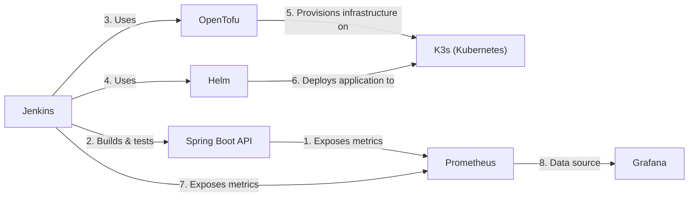

# System Architecture

This document provides an overview of the system architecture and component details for the DevOps Deployment System.

## System Overview

This project implements a comprehensive system with multiple components working together.

### System Architecture Diagram

## Component Details

### Application Components

The application layer consists of:

- The API is built with Java 21 and Spring Boot 3.2.0
- Exposes metrics via Spring Boot Actuator for monitoring

### CI/CD Pipeline

The CI/CD layer includes:

- **Jenkins**: Automation server that handles the build, test, and deployment pipeline
  - Manages the entire deployment process from code to production
  - Integrates with Docker for containerization
  - Runs tests and fails the pipeline if tests fail

- **Helm**: Package manager for Kubernetes
  - Used to package and deploy applications to Kubernetes
  - Manages application releases and updates
  - Provides templating for Kubernetes manifests
  - Located in `helm/sample-app`
  - Available in Docker Compose for local development

- **OpenTofu**: Infrastructure as Code tool (fork of Terraform)
  - Provisions and manages infrastructure resources
  - Creates Kubernetes namespaces for infrastructure and applications
  - Deploys Jenkins, Prometheus, and Grafana to the infrastructure namespace
  - Located in `opentofu`
  - Available in Docker Compose for local development

- **K3s**: Lightweight Kubernetes distribution
  - Provides a local Kubernetes cluster for development and testing
  - Used as the target for both infrastructure and application deployments
  - Available in Docker Compose for local development
  - Configured as the Kubernetes context for Helm and OpenTofu

### Monitoring System

The monitoring and observability layer includes:

- **Prometheus**: Time-series database that collects and stores metrics
- **Grafana**: Visualization tool that creates dashboards from Prometheus data

## System Interactions

The components interact in the following ways:

1. The **Spring Boot API** exposes metrics that are collected by Prometheus
2. **Jenkins** builds and deploys the API and also exposes its own metrics
3. **K3s** provides a Kubernetes cluster for deploying applications
4. **Helm** deploys applications to the K3s cluster
5. **OpenTofu** provisions infrastructure resources on the K3s cluster
6. **Prometheus** scrapes and stores metrics from all components
7. **Grafana** visualizes the metrics stored in Prometheus