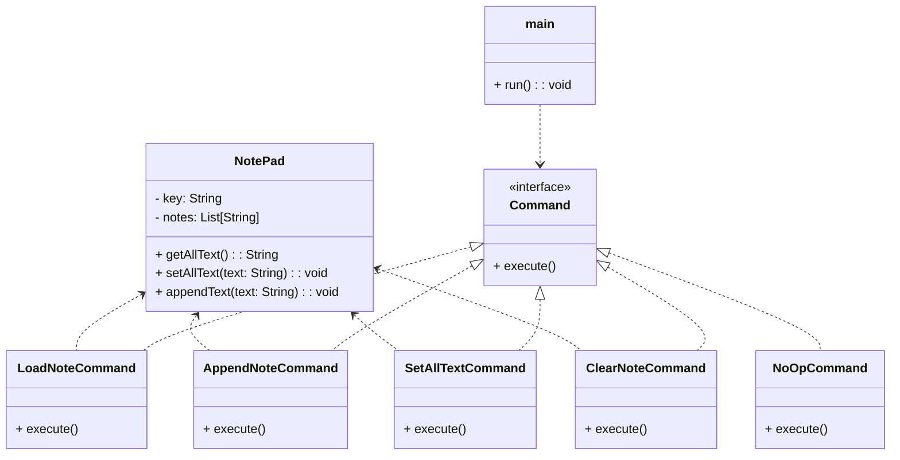

# **DontPad Command App (Java)**

## **Overview**

A minimal local clone of dontpad.com. Each URL (e.g., `/mypage`) represents a separate document. When you open a document, all its text is loaded and shown for copying/editing. Any new text you enter is appended after the existing content.

## **Tech Stack**

- **Java 25** → Modern Java with records and pattern matching.
- **Gradle** → Build tool.

## **Architecture Diagram**



## **Setup Instructions**

### **1 - Clone the Repository**

```bash
git clone https://github.com/rbleggi/tech-pocs.git
cd java/dont-pad
```

### **2 - Compile & Run the Application**

```shell
./gradlew run
```

### **3 - Run Tests**

```shell
./gradlew test
```