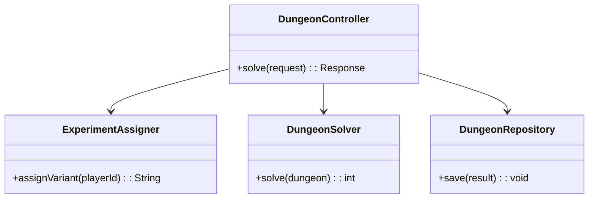

# **Dungeon Game REST API**

## Overview

A Spring Boot 3.5.4 REST API that solves the Dungeon Game problem, supports A/B testing experiments, and persists results in PostgreSQL 17. The application is fully containerized with Docker and uses Flyway for database migrations.

---

## Tech Stack

- **Java 25** → Modern Java with enhanced features.
- **Spring Boot** → REST API framework.
- **PostgreSQL** → Database for persistent storage.
- **Docker** → Containerization platform.
- **Gradle** → Build tool.
- **JDK 25** → Required to run the application.

---

## Architecture Diagram



---

## Setup Instructions

### 1 - Clone the Repository

```bash
git clone https://github.com/rbleggi/tech-pocs.git
cd java/dungeon-game
```

### 2 - Compile & Run the Application

```bash
docker compose up --build
```

### 3 - Run Tests

```bash
./gradlew test
```

