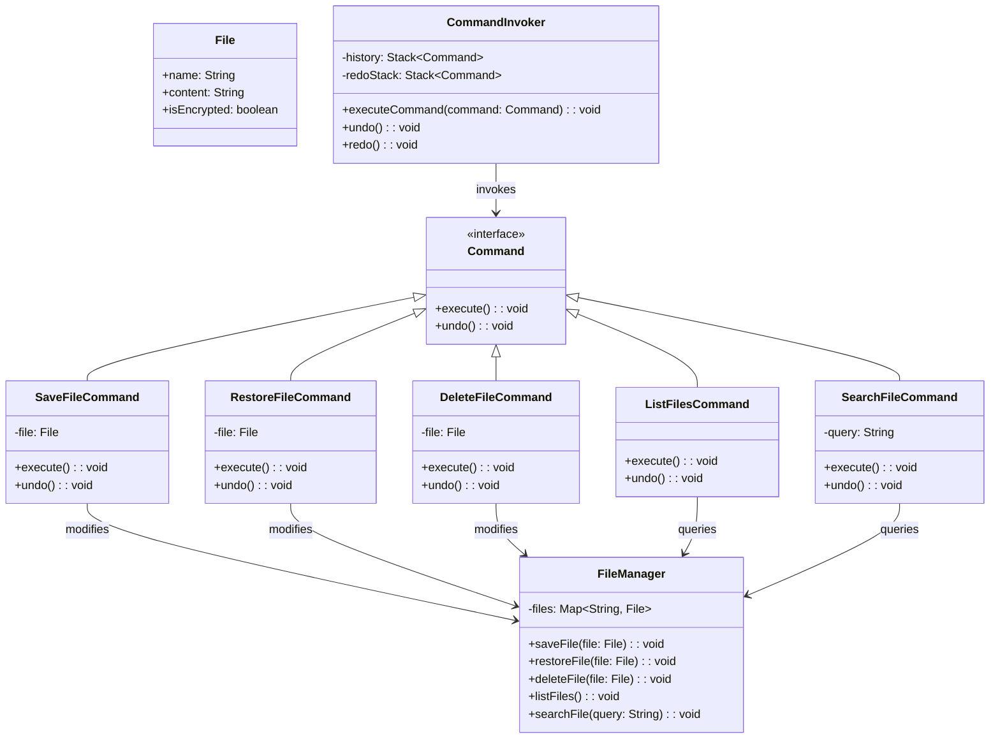

# **FileShare System**

## Overview

This project implements a **flexible and maintainable file-sharing system** using the **Command Pattern**. Users can save files, restore files, delete files, list all files, and search for specific files. The system also supports undo and redo functionality for all actions.

## Tech Stack

- **Java 25** → Modern JVM-based language with records and enhanced features.
- **Gradle** → Build automation tool.

## Architecture Diagram



## Setup Instructions

### 1 - Clone the Repository

```bash
git clone https://github.com/rbleggi/tech-pocs.git
cd java/file-share
```

### 2 - Compile & Run the Application

```bash
./gradlew run
```

### 3 - Run Tests

```bash
./gradlew test
```
