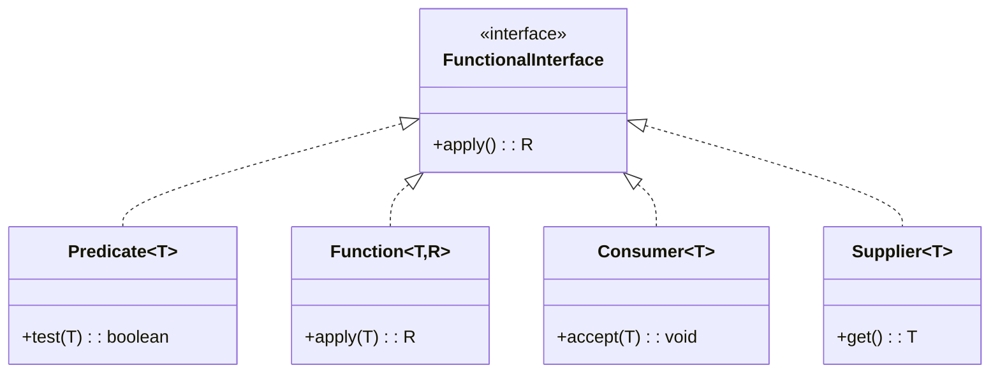

# **Functional Interfaces Guide**

## Overview

A comprehensive guide demonstrating Java functional interfaces, lambdas, and method references. Includes examples of Predicate, Function, Consumer, Supplier, UnaryOperator, BinaryOperator, BiFunction, BiPredicate, BiConsumer, custom functional interfaces, method references, and function composition.

---

## Tech Stack

- **Java 25** → Modern Java with functional programming features.
- **Gradle** → Build tool.
- **JDK 25** → Required to run the application.

---

## Architecture Diagram



---

## Setup Instructions

### 1 - Clone the Repository

```bash
git clone https://github.com/rbleggi/tech-pocs.git
cd java/functional-interfaces-guide
```

### 2 - Compile & Run the Application

```bash
./gradlew build run
```

### 3 - Run Tests

```bash
./gradlew test
```
