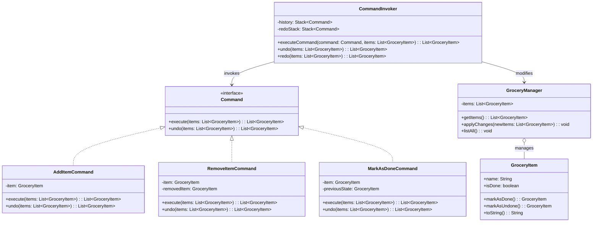

# **Grocery TODO List**

## Overview

This project implements a **flexible and maintainable grocery TODO list system** using the **Command Pattern**. Users can add items, remove items, mark items as done, undo actions, redo actions, and list all items - all through a simple, unified interface.

## Tech Stack

- **Java 25** → Modern JVM-based language with enhanced features.
- **Gradle** → Build automation tool.

## Architecture Diagram



## Setup Instructions

### 1 - Clone the Repository

```bash
git clone https://github.com/rbleggi/tech-pocs.git
cd java/grocery-todo-list
```

### 2 - Compile & Run the Application

```bash
./gradlew run
```

### 3 - Run Tests

```bash
./gradlew test
```
