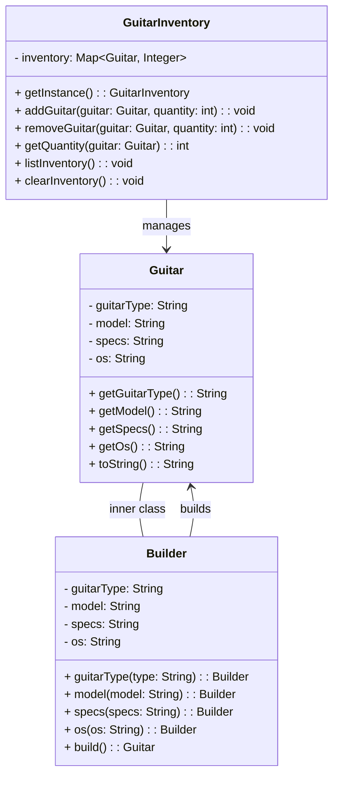

# **Guitar Builder**

## **Overview**

This project implements a **custom guitar builder system** that allows users to flexibly create personalized guitars by specifying attributes such as **type, model, specifications, and operating system (OS)**. It also includes an **inventory management system**, tracking available guitars and their quantities.

The project utilizes the **Builder Pattern** to streamline guitar creation with flexibility and readability and uses a **Singleton Pattern** for centralized, consistent inventory management.

---

## **Tech Stack**

- **Java 21** → Modern JVM-based language with enhanced features.
- **Gradle** → Build automation tool.
- **JUnit 5** → Testing framework.

---

## **Features**

- **Flexible Guitar Creation** → Users specify guitar attributes dynamically.
- **Inventory Management** → Tracks available guitars and stock levels.
- **Builder Pattern** → Simplifies the creation of guitars through a fluent interface.
- **Singleton Inventory** → Ensures centralized and consistent stock control.
- **Scalability** → Easily extendable to accommodate additional guitar attributes.

---

## **Architecture Diagram**



---

## **Builder Pattern**

The **Builder Pattern** simplifies creating guitars with various attributes without needing separate subclasses for each guitar type. It provides a fluent API that:

- **Allows chaining methods** to set guitar attributes (`type`, `model`, `specs`, `os`).
- **Encapsulates construction logic** within the `Builder`, separating it from the `Guitar` class itself.
- **Produces immutable `Guitar` instances** after calling the `build()` method.

---

## **Singleton Pattern**

The **Singleton Pattern** ensures a single, consistent inventory system (`GuitarInventory`) is available throughout the application's lifecycle. This prevents inconsistencies and duplicate inventories, ensuring that all operations (add, remove, list) interact with the same shared data source.

---

## **Setup Instructions**

### **1️ - Clone the Repository**

```shell
git clone https://github.com/rbleggi/tech-pocs.git
cd java/guitar-factory
```

### **2️ - Compile & Run the Application**

```shell
./gradlew run
```

### **3️ - Run Tests**

```shell
./gradlew test
```
