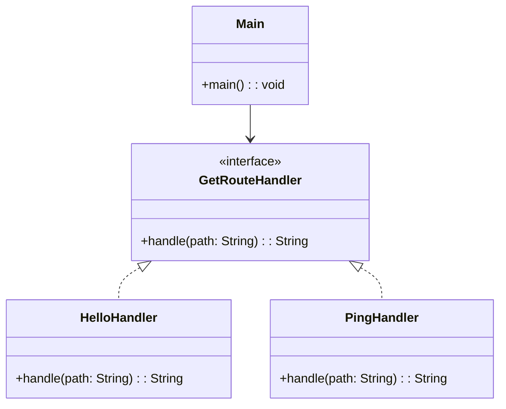

# Java HTTP Server

## Overview

This project implements a simple and extensible HTTP server in Java using the Strategy Pattern. It supports custom GET endpoints and demonstrates how to compose route handlers in a clean, extensible way.

## Tech Stack

- **Java 25** → Modern Java with functional programming features
- **Gradle** → Build tool

## Architecture Diagram



## **Setup Instructions**

### **1️ - Clone the Repository**

```bash
git clone https://github.com/rbleggi/tech-pocs.git
cd java/http-server
```

### **2️ - Compile & Run the Application**

```shell
./gradlew build run
```

### **3️ - Run Tests**

```shell
./gradlew test
```
