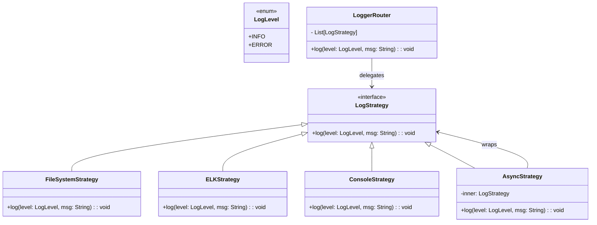

# Logger Router

## Overview

This project implements a **lightweight and flexible log routing system** using the **Strategy Pattern**. Logs can be sent to multiple destinations like **FileSystem**, **ELK**, or **Console**, with support for **synchronous or asynchronous delivery** — all through a simple, unified interface.

## Tech Stack

- **Java 21** → Modern Java with records and enhanced features
- **Gradle** → Build tool
- **JUnit 5** → Testing framework

## Features

- **Multi-Destination Logging** → File, ELK, and Console supported
- **Sync or Async per Strategy** → Configure independently for each target
- **Strategy Pattern** → Logging logic is cleanly separated and reusable
- **No Boilerplate** → No builder or wrapper classes required
- **Minimal API** → Log directly via `.log(LogLevel, message)`

## Architecture



## Strategy Pattern

The **Strategy Pattern** allows each logging destination to encapsulate its own behavior. Instead of hardcoding log handling:

- Each destination implements `LogStrategy`
- The router (`LoggerRouter`) delegates the log call to all configured strategies
- `AsyncStrategy` wraps any existing strategy to make it non-blocking
- No wrapper classes or builders are needed — just build a list of strategies

## Setup Instructions

### 1 - Clone the Repository

```bash
git clone https://github.com/rbleggi/tech-pocs.git
cd java/logger-router
```

### 2 - Build & Run the Application

```bash
./gradlew build
./gradlew run
```

### 3 - Run Tests

```bash
./gradlew test
```