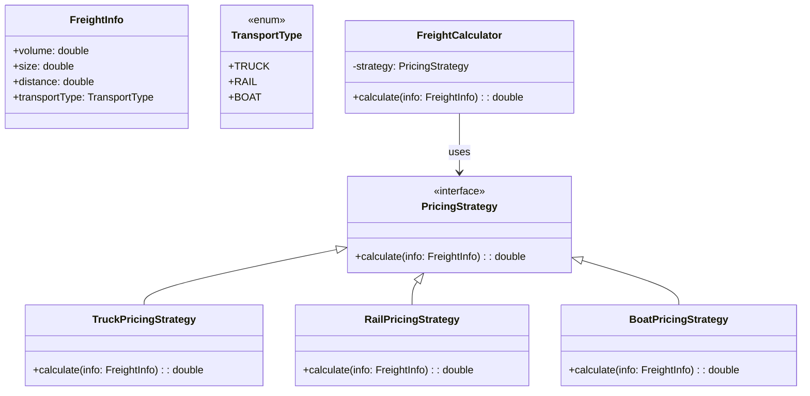

# **Logistic Pricing**

## Overview

This project implements a modular and extensible freight pricing system using the Strategy Pattern. Freight costs are dynamically calculated based on factors like volume, size, and transport type such as Truck, Rail, or Boat.

---

## Tech Stack

- **Java 25** → Modern Java with records and pattern matching.
- **Gradle** → Build tool.
- **JDK 25** → Required to run the application.

---

## Architecture Diagram



---

## Setup Instructions

### 1 - Clone the Repository

```bash
git clone https://github.com/rbleggi/tech-pocs.git
cd java/logistic-pricing
```

### 2 - Compile & Run the Application

```bash
./gradlew build run
```

### 3 - Run Tests

```bash
./gradlew test
```
