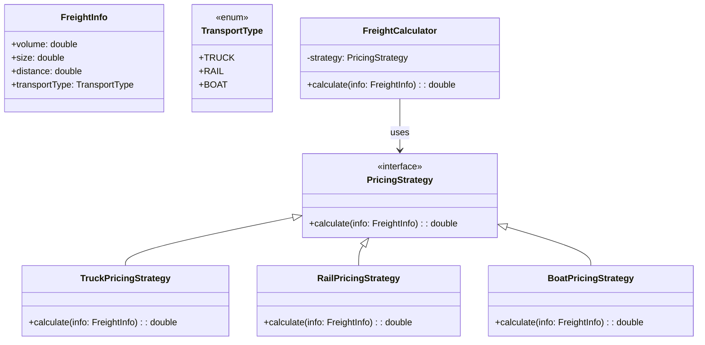

# Logistic Pricing

## Overview

This project implements a **modular and extensible freight pricing system** using the **Strategy Pattern**. Freight costs are dynamically calculated based on factors like **volume, size, and transport type** — such as **Truck**, **Rail**, or **Boat** — with prices subject to **real-time variability**.

## Tech Stack

- **Java 21** → Modern Java with records and pattern matching
- **Gradle** → Build tool
- **JUnit 5** → Testing framework

## Features

- **Strategy-Based Price Calculation** → Easily plug in new pricing models
- **Supports Multiple Transport Types** → Truck, Rail, Boat
- **Dynamic Pricing** → Pricing logic is fully decoupled and runtime-driven
- **Extensible Design** → Add more transport strategies without touching core logic
- **Minimal Boilerplate** → No builder classes or verbose configuration

## Architecture



## Strategy Pattern

Using the **Strategy Pattern**, the pricing logic is abstracted away from the core calculator:

1. Each transport mode implements its own `PricingStrategy`
2. `FreightCalculator` delegates calculation to the selected strategy
3. Easily swap or update strategies at runtime
4. No need to modify core logic when adding a new transport type or changing pricing logic

## Setup Instructions

### 1 - Clone the Repository

```bash
git clone https://github.com/rbleggi/tech-pocs.git
cd java/logistic-pricing
```

### 2 - Build & Run the Application

```bash
./gradlew build
./gradlew run
```

### 3 - Run Tests

```bash
./gradlew test
```

## Expected Output
```
Freight using TRUCK costs $[dynamic value]
Freight using RAIL costs $[dynamic value]
Freight using BOAT costs $[dynamic value]
```
