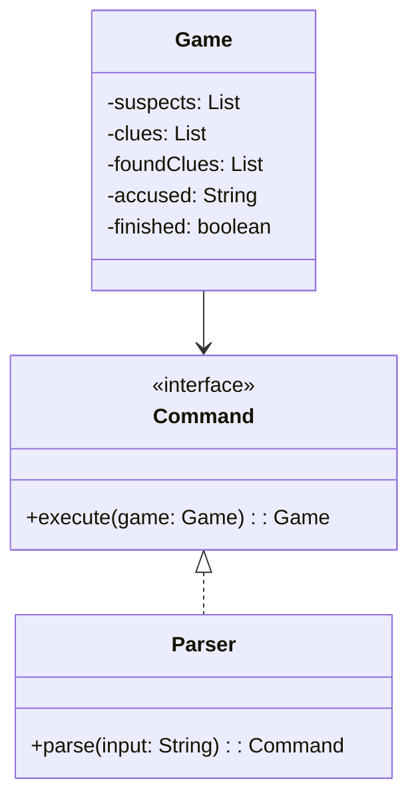

# **Murder Mystery Game**

## Overview

This project implements a simple terminal-based Murder Mystery game in Java. The player interacts via commands to find clues and accuse suspects. The solution uses the Command pattern to handle user actions and game logic.

---

## Tech Stack

- **Java 25** → Modern Java with records and pattern matching features.
- **Gradle** → Official build tool for Java projects.
- **JDK 25** → Required to run the application.

---

## Architecture Diagram



---

## Setup Instructions

### 1 - Clone the Repository

```bash
git clone https://github.com/rbleggi/tech-pocs.git
cd java/murder-mistery-game
```

### 2 - Compile & Run the Application

```bash
./gradlew build run
```

### 3 - Run Tests

```bash
./gradlew test
```
