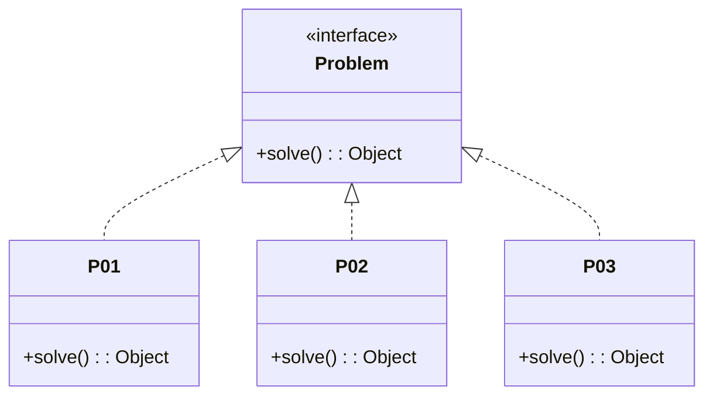

# **Ninety-Nine Problems**

## Overview

This project implements solutions to the classic "Ninety-Nine Problems" in Java. These problems are a collection of algorithmic challenges designed to improve functional programming skills. Each problem is implemented as a separate class with a main method for demonstration.

---

## Tech Stack

- **Java 25** → Modern Java with functional programming features.
- **Gradle** → Official build tool for Java projects.
- **JDK 25** → Required to run the application.

---

## Architecture Diagram



---

## Setup Instructions

### 1 - Clone the Repository

```bash
git clone https://github.com/rbleggi/tech-pocs.git
cd java/ninety-nine
```

### 2 - Compile & Run the Application

```bash
./gradlew build run
```

### 3 - Run Tests

```bash
./gradlew test
```
