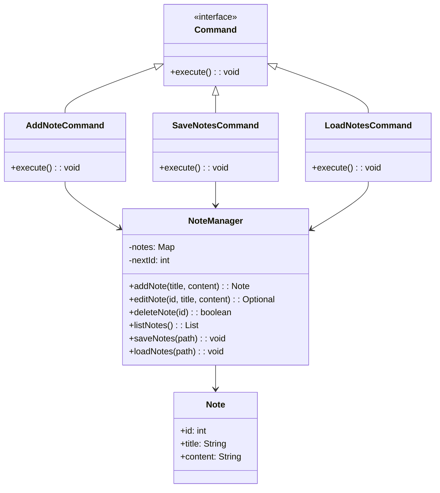

# Note Taking System

## Overview

This project implements a **note management system** using the **Command Pattern**. It supports creating, editing, deleting notes, and persisting them to disk with file-based storage.

## Tech Stack

- **Java 21** → Modern Java with records and enhanced features
- **Gradle** → Build tool
- **JUnit 5** → Testing framework

## Features

- **Command Pattern** → All operations encapsulated as commands
- **CRUD Operations** → Add, edit, delete, list notes
- **File Persistence** → Save and load notes from disk
- **Command History** → Track all executed commands
- **Simple API** → Easy to extend with new commands

## Architecture



## Command Pattern

The **Command Pattern** encapsulates each operation as a command:

- Each operation (add, edit, delete, save, load) is a command
- Commands can be executed independently
- Easy to add undo/redo functionality
- Command history tracking for audit

## Setup Instructions

### 1 - Clone the Repository
```bash
git clone https://github.com/rbleggi/tech-pocs.git
cd java/note-taking
```

### 2 - Build & Run the Application
```bash
./gradlew build
./gradlew run
```

### 3 - Run Tests
```bash
./gradlew test
```