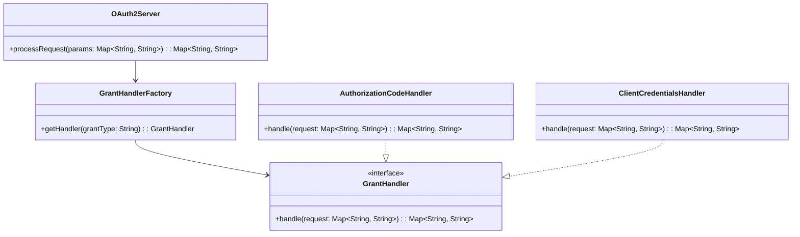

# **OAuth 2.0 Server (Java)**

## Overview

This project demonstrates a minimal **OAuth 2.0 Server** in **Java** using the **Factory Pattern** to handle extensible grant types. The solution allows easy addition of new OAuth 2.0 flows and contains all logic in a single file.

---

## Tech Stack

- **Java 21** → Modern Java with switch expressions and pattern matching.
- **Gradle** → Build tool for Java projects.

---

## Architecture Diagram



---

## Setup Instructions

### 1 - Clone the Repository

```bash
git clone https://github.com/rbleggi/tech-pocs.git
cd java/oauth2
```

### 2 - Compile & Run the Application

```bash
./gradlew build
./gradlew run
```

### 3 - Run Tests

```bash
./gradlew test
```
