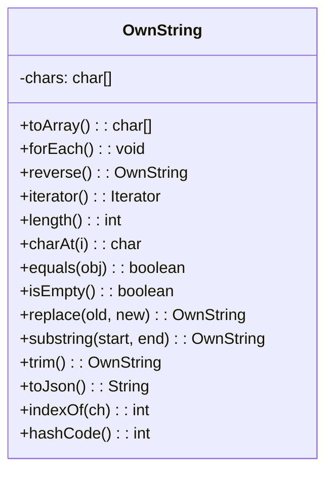

# **Own String Implementation**

## Overview

This project demonstrates a custom String implementation in Java. The solution uses the Decorator Pattern to extend and encapsulate string operations in a single class, providing methods like toArray, forEach, reverse, iterator, length, charAt, equals, isEmpty, replace, substring, trim, toJson, indexOf, and hashCode.

---

## Tech Stack

- **Java 25** → Modern Java with pattern matching and enhanced features.
- **Gradle** → Build tool for Java projects.
- **JDK 25** → Required to run the application.

---

## Architecture Diagram



---

## Setup Instructions

### 1 - Clone the Repository

```bash
git clone https://github.com/rbleggi/tech-pocs.git
cd java/own-string-impl
```

### 2 - Compile & Run the Application

```bash
./gradlew build run
```

### 3 - Run Tests

```bash
./gradlew test
```
