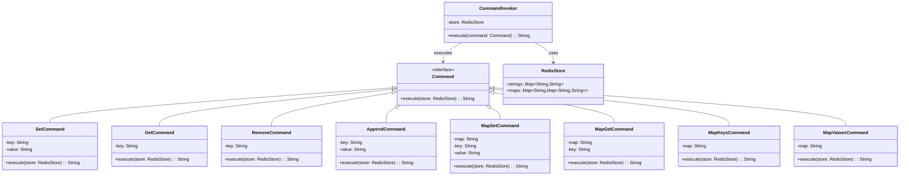

# Redis Clone

## Overview

This project implements an **in-memory key-value store** inspired by Redis, supporting **string and map operations**. The system follows the **Command Pattern**, where each operation is encapsulated as a command that can be executed against the store, enabling **extensibility and clean separation of concerns**.

## Tech Stack

- **Java 21** → Modern Java with records and enhanced features
- **Gradle** → Build tool
- **JUnit 5** → Testing framework

## Features

- **String Operations** → SET, GET, REMOVE, APPEND commands
- **Map Operations** → HSET, HGET, HKEYS, HVALS commands
- **Command Pattern** → Each operation is a self-contained command
- **In-Memory Storage** → Fast HashMap-based data structures
- **Easily Extensible** → Add new commands without modifying core logic

## Architecture



## Command Pattern

The **Command Pattern** is used to **encapsulate requests as objects**, allowing:
- **Each operation is a separate command** implementing the `Command` interface
- **`CommandInvoker` executes commands** against the `RedisStore`
- **Commands know how to execute themselves**, ensuring encapsulation
- **Easy extension with new commands** without touching existing code
- **Clean separation** between the invoker and the receiver (RedisStore)

## Setup Instructions

### 1 - Clone the Repository
```bash
git clone https://github.com/rbleggi/tech-pocs.git
cd java/redis-clone
```

### 2 - Build & Run the Application
```bash
./gradlew build
./gradlew run
```

### 3 - Run Tests
```bash
./gradlew test
```
