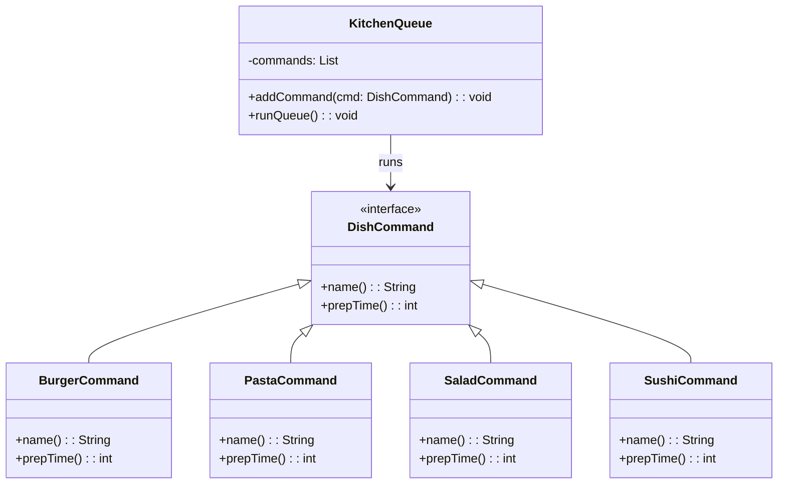

# **Restaurant Queue**

## Overview

This project implements a modular restaurant queue system using the Command Pattern. Each dish preparation is encapsulated in a separate command that knows how long it takes to prepare. The system queues these commands and reports the total and per-dish prep time.

---

## Tech Stack

- **Java 25** → Modern Java with enhanced features.
- **Gradle** → Build tool.
- **JDK 25** → Required to run the application.

---

## Architecture Diagram



---

## Setup Instructions

### 1 - Clone the Repository
```bash
git clone https://github.com/rbleggi/tech-pocs.git
cd java/restaurant-queue
```

### 2 - Compile & Run the Application
```bash
./gradlew build run
```

### 3 - Run Tests
```bash
./gradlew test
```