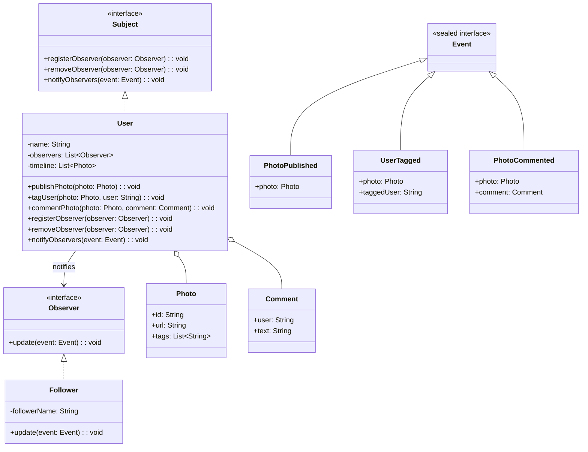

# **Social Media Sharing Photo App**

## **Overview**

A modular social media photo sharing PoC in Java, demonstrating core features (publish, tag, timeline, comments) and event-driven notifications using the **Observer Pattern**. Followers are notified when users publish, tag, or comment on photos.

---

## **Tech Stack**

- **Java 21** → Modern Java with sealed interfaces and pattern matching.
- **Gradle** → Build automation tool for Java projects.
- **JDK 21** → Required to run the application.

---

## **Architecture Diagram**



---

## **Setup Instructions**

### **1 - Clone the Repository**

```bash
git clone https://github.com/rbleggi/tech-pocs.git
cd java/social-media-photo-app
```

### **2 - Compile & Run the Application**

```bash
./gradlew build
./gradlew run
```

### **3 - Run Tests**

```bash
./gradlew test
```