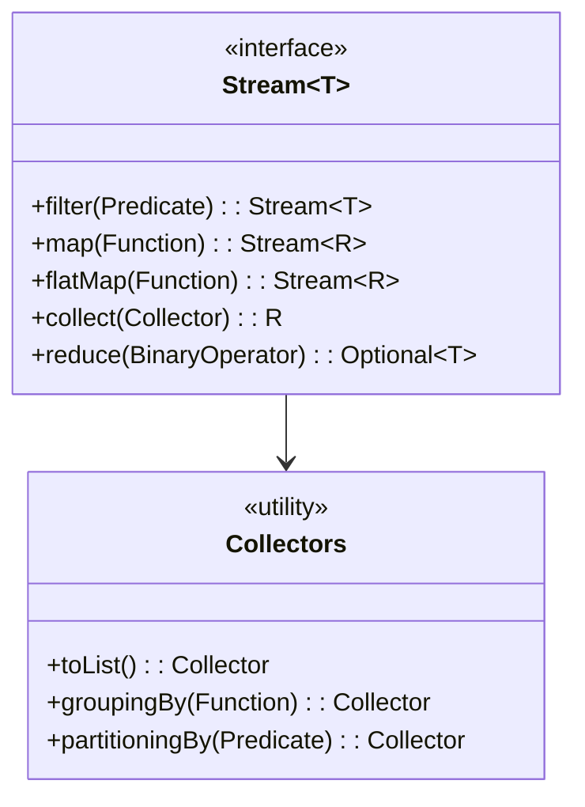

# **Streams Comprehensive Guide**

## Overview

A comprehensive guide demonstrating Java Stream API with examples including stream creation, filter/map/reduce, flatMap, collectors, grouping/partitioning, sorting, matching, numeric streams, parallel streams, and advanced operations.

---

## Tech Stack

- **Java 25** → Modern Java with Stream API and functional programming features.
- **Gradle** → Build tool.
- **JDK 25** → Required to run the application.

---

## Architecture Diagram



---

## Setup Instructions

### 1 - Clone the Repository

```bash
git clone https://github.com/rbleggi/tech-pocs.git
cd java/streams-comprehensive
```

### 2 - Compile & Run the Application

```bash
./gradlew build run
```

### 3 - Run Tests

```bash
./gradlew test
```
