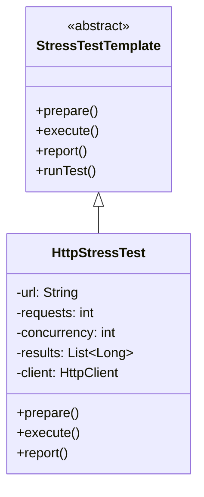

# **HTTP Stress Test Framework**

## Overview

This project implements a stress test framework for HTTP endpoints using Java. It allows users to configure the number of requests, concurrency level, and target URL to evaluate the performance and reliability of HTTP services under load.

---

## Tech Stack

- **Java 25** → Modern Java with virtual threads for efficient concurrency.
- **Gradle** → Build tool for Java projects.
- **JDK 25** → Required to run the application.

---

## Architecture Diagram



---

## Setup Instructions

### 1 - Clone the Repository

```bash
git clone https://github.com/rbleggi/tech-pocs.git
cd java/stress-test-http-framework
```

### 2 - Compile & Run the Application

```bash
./gradlew build run
```

### 3 - Run Tests

```bash
./gradlew test
```
