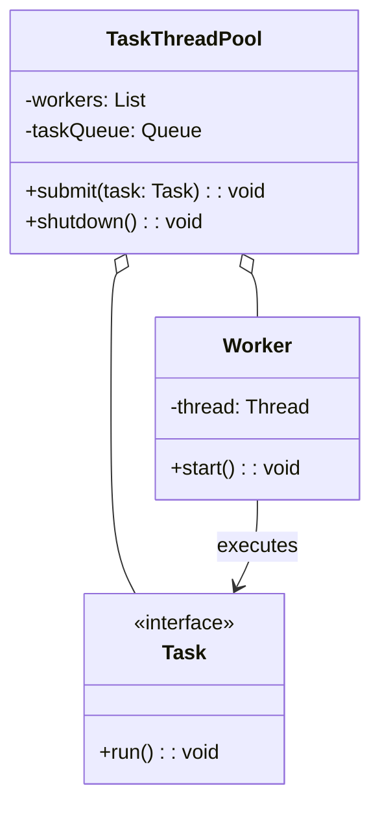

# Task ThreadPool (Java)

## Overview

A modular Java PoC for concurrent task execution using a custom thread pool. Demonstrates core features: task submission, thread pool management, and graceful shutdown. All logic is contained in a single file for simplicity and easy extensibility.

---

## Tech Stack

- **Java 21** → Modern Java with enhanced concurrency features.
- **Gradle** → Build tool for Java projects.

---

## Architecture Diagram



---

## Setup Instructions

### 1 - Clone the Repository

```cmd
git clone https://github.com/rbleggi/tech-pocs.git
cd java\task-threadpool
```

### 2 - Compile & Run the Application

```cmd
gradlew.bat run
```

### 3 - Run Tests

```cmd
gradlew.bat test
```
