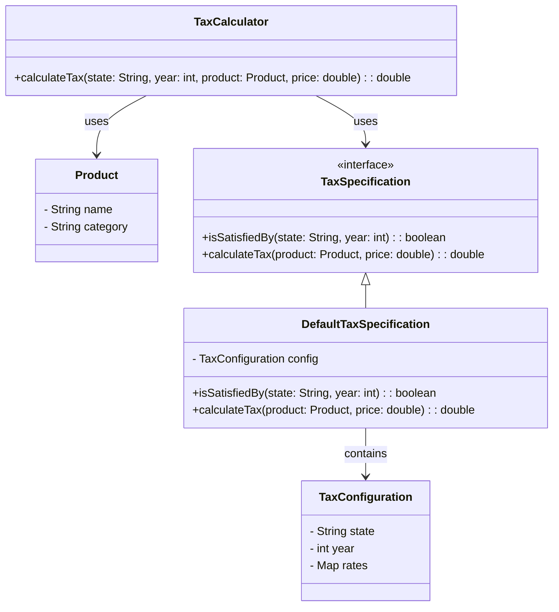

# **TAX System**

## Overview

This project demonstrates a dynamic tax calculation system where different products are subject to varying tax rates based on state and year. The system follows the Specification Pattern, ensuring that tax rules are modular, extensible, and easily adaptable to changes.

---

## Tech Stack

- **Java 25** → Modern Java with records and pattern matching.
- **Gradle** → Build tool.
- **JDK 25** → Required to run the application.

---

## Architecture Diagram



---

## Setup Instructions

### 1 - Clone the Repository
```bash
git clone https://github.com/rbleggi/tech-pocs.git
cd java/tax-system
```

### 2 - Compile & Run the Application
```bash
./gradlew build run
```

### 3 - Run Tests
```bash
./gradlew test
```