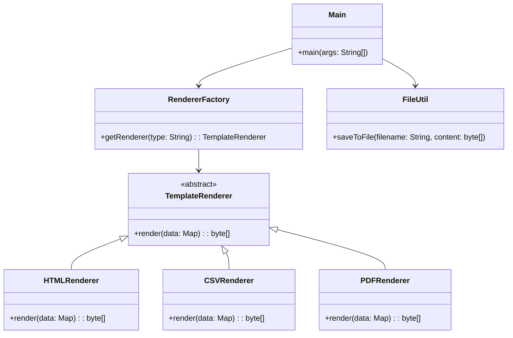

# Template Renderer Project

## Overview

This project follows an **Object-Oriented Design (OOP)** approach to generate templates in **HTML, CSV, and PDF** formats. It uses:

- **Java 21** → Modern Java with enhanced language features.
- **iText** → A library for PDF generation.

---

## Architecture Diagram



## Setup Instructions

1. **Clone the Repository**:
   ```bash
   git clone https://github.com/rbleggi/tech-pocs.git
   cd java/template-renderer
   ```

2. **Compiling & Running**:
   ```bash
   ./gradlew build run
   ```

3. **Tests**:
   ```sh
   ./gradlew test
   ```