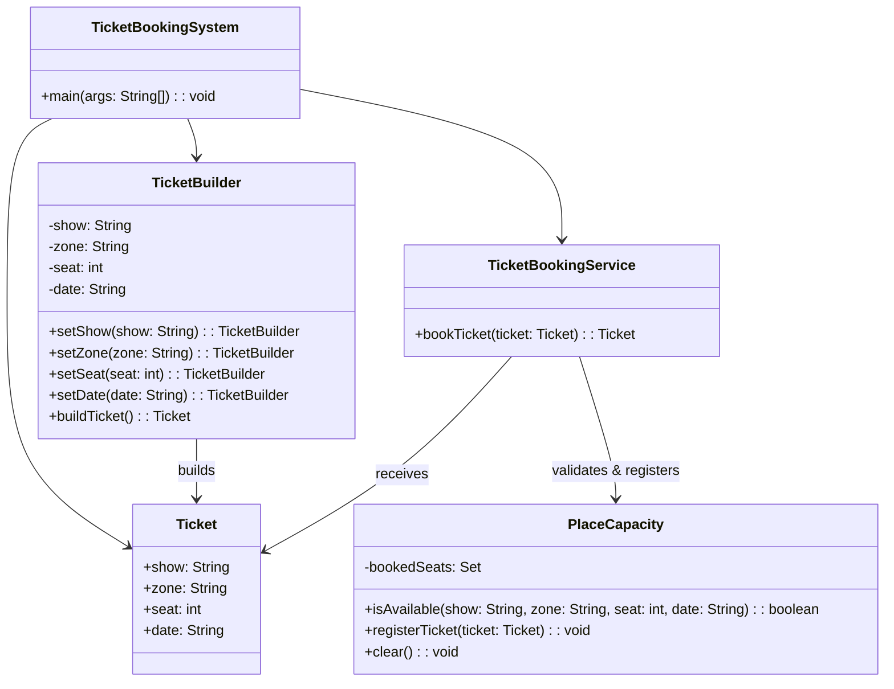

# **Ticket Booking**

## Overview

This project implements a flexible and safe ticket booking system using the Builder Pattern. Users can choose zones, dates, seats, and shows, while the system enforces maximum place capacity and prevents overbooking. The entire implementation is contained in a single file for simplicity.

---

## Tech Stack

- **Java 25** → Modern Java with records and enhanced features.
- **Gradle** → Build tool.
- **JDK 25** → Required to run the application.

---

## Architecture Diagram



---

## Setup Instructions

### 1 - Clone the Repository

```bash
git clone https://github.com/rbleggi/tech-pocs.git
cd java/ticket-booking
```

### 2 - Compile & Run the Application

```bash
./gradlew build run
```

### 3 - Run Tests

```bash
./gradlew test
```
