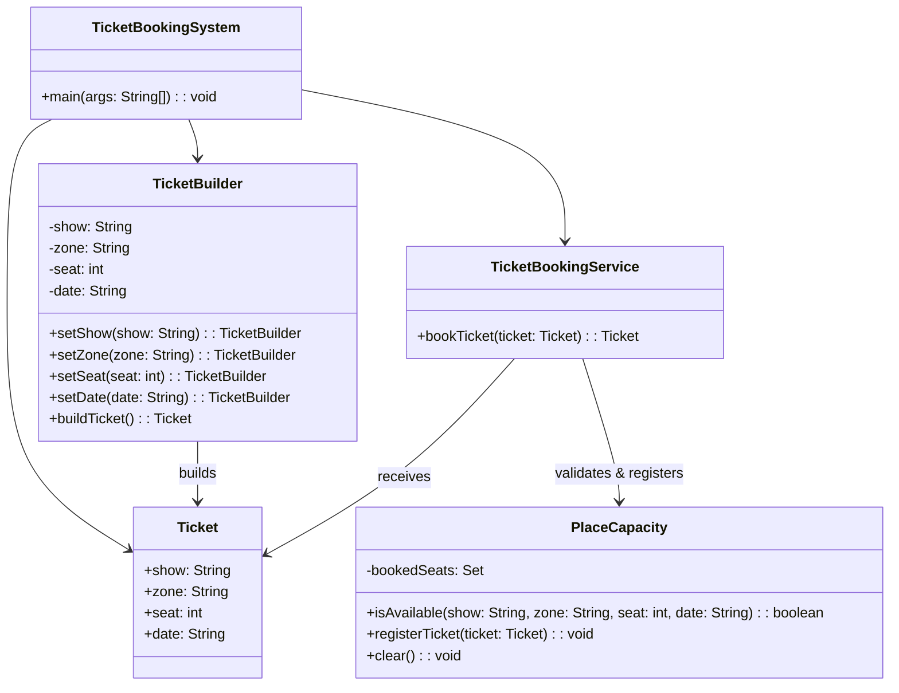

# Ticket Booking

## Overview

This project implements a flexible and safe ticket booking system using the Builder Pattern. Users can choose zones, dates, seats, and shows, while the system enforces maximum place capacity and prevents overbooking. The entire implementation is contained in a single file for simplicity.

## Tech Stack

- **Java 21** → Modern Java with records and enhanced features
- **Gradle** → Build tool
- **JUnit 5** → Testing framework

## Features

- **Builder Pattern** → Flexible ticket construction via fluent API
- **Zone & Seat Selection** → Pick specific seats from configured areas
- **Capacity Enforcement** → No overbooking allowed per show/zone
- **Multiple Shows Support** → Maintain date- and show-specific logic
- **Single-File Implementation** → All classes in one file for easy understanding
- **Easy to Extend** → Add pricing, QR codes, or validation later

## Architecture



## Builder Pattern

The Builder Pattern provides a fluent interface for building a ticket with many required parameters:

1. Choose the show, zone, seat, and date
2. The builder validates it through a PlaceCapacity registry
3. If valid, it returns a Ticket object — if not, it throws an error
4. All logic is encapsulated, so clients don't deal with constraints directly

## Single-File Design

All classes are nested within `TicketBookingSystem.java`:
- `Ticket` - Record for ticket data
- `TicketBuilder` - Builder for creating tickets
- `PlaceCapacity` - Static class managing seat availability
- `TicketBookingService` - Service for booking tickets
- `main` - Demo application

## Setup Instructions

### 1. Clone the Repository

```bash
git clone https://github.com/rbleggi/tech-pocs.git
cd java/ticket-booking
```

### 2. Build & Run the Application

```bash
./gradlew build
./gradlew run
```

### 3. Run Tests

```bash
./gradlew test
```

## Example Usage

```java
var bookingService = new TicketBookingSystem.TicketBookingService();

var ticket = new TicketBookingSystem.TicketBuilder()
    .setShow("Iron Maiden")
    .setZone("1")
    .setSeat(12)
    .setDate("2025-05-01")
    .buildTicket();

var bookedTicket = bookingService.bookTicket(ticket);
System.out.println("Ticket booked: " + bookedTicket);
```

## Sample Output

```
Ticket booked: Ticket[show=Iron Maiden, zone=1, seat=12, date=2025-05-01]
Booking failed: Seat 12 in zone 1 for 'Iron Maiden' on 2025-05-01 is already booked.
```
