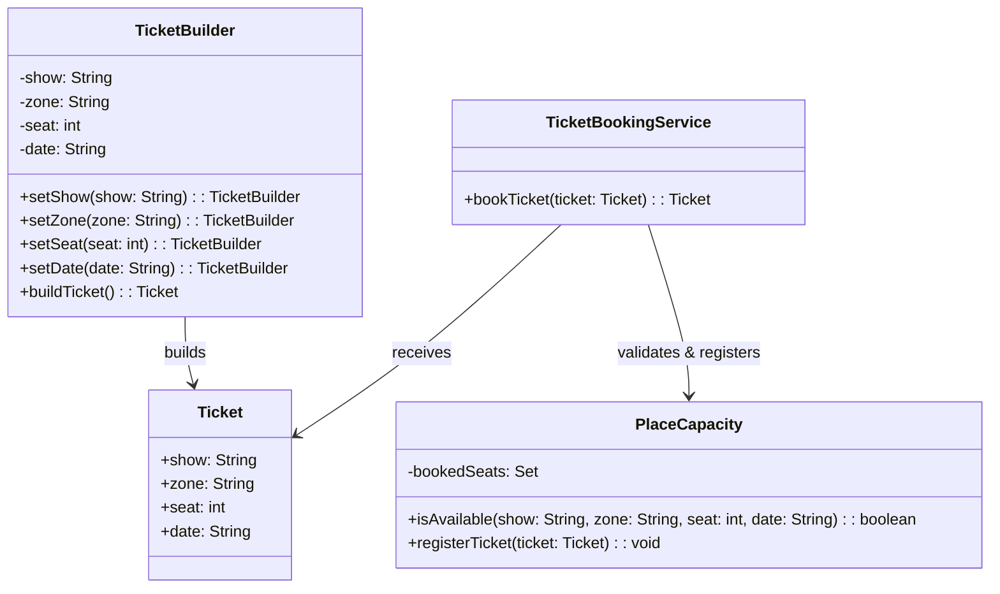

# Ticket Booking

## Overview

This project implements a **flexible and safe ticket booking** using the **Builder Pattern**. Users can choose **zones**, **dates**, **seats**, and **shows**, while the system enforces **maximum place capacity** and prevents overbooking.

## Tech Stack

- **Java 21** → Modern Java with records and enhanced features
- **Gradle** → Build tool
- **JUnit 5** → Testing framework

## Features

- **Builder Pattern** → Flexible ticket construction via fluent API
- **Zone & Seat Selection** → Pick specific seats from configured areas
- **Capacity Enforcement** → No overbooking allowed per show/zone
- **Multiple Shows Support** → Maintain date- and show-specific logic
- **Easy to Extend** → Add pricing, QR codes, or validation later

## Architecture



## Builder Pattern

The **Builder Pattern** provides a fluent interface for building a ticket with many required parameters:

1. Choose the show, zone, seat, and date
2. The builder validates it through a **PlaceCapacity** registry
3. If valid, it returns a `Ticket` object — if not, it throws an error
4. All logic is **encapsulated**, so clients don't deal with constraints directly

## Setup Instructions

### 1 - Clone the Repository

```bash
git clone https://github.com/rbleggi/tech-pocs.git
cd java/ticket-booking
```

### 2 - Build & Run the Application

```bash
./gradlew build
./gradlew run
```

### 3 - Run Tests

```bash
./gradlew test
```